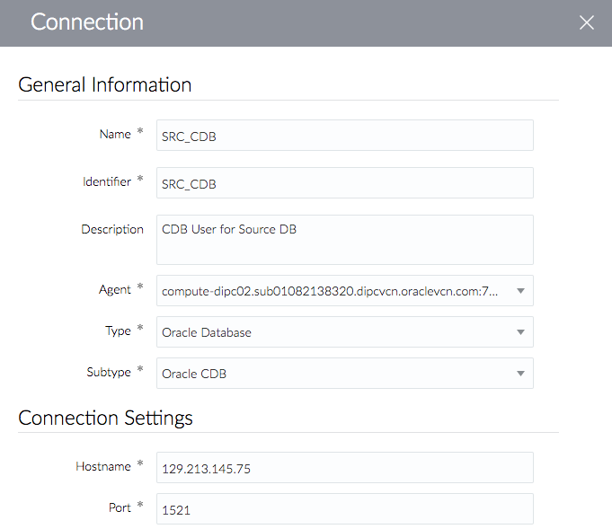
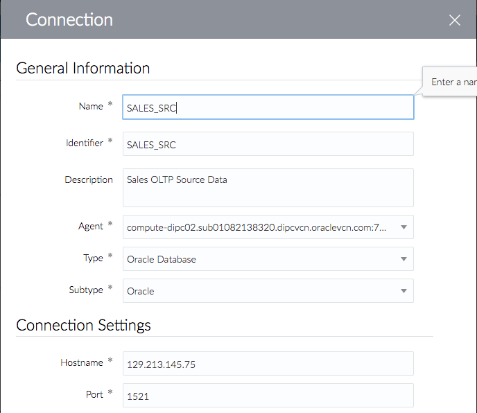
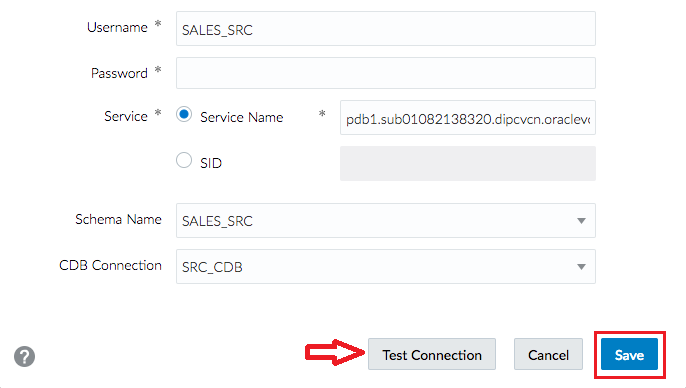
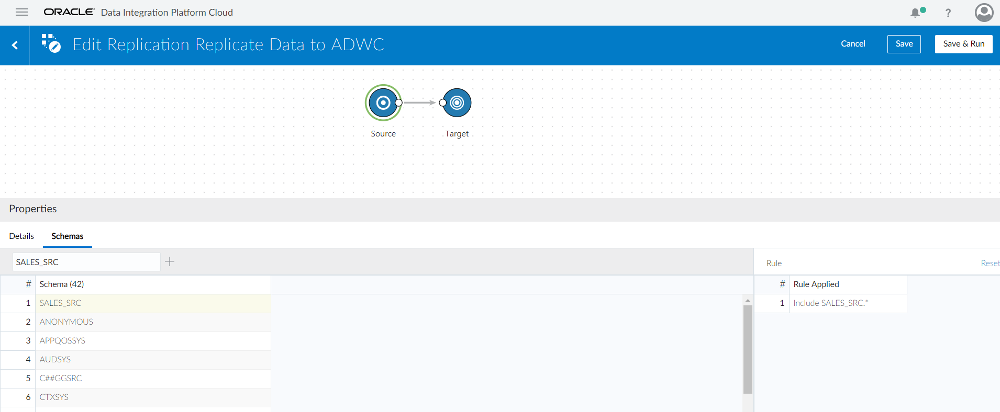
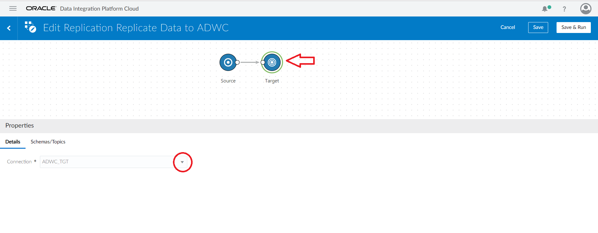
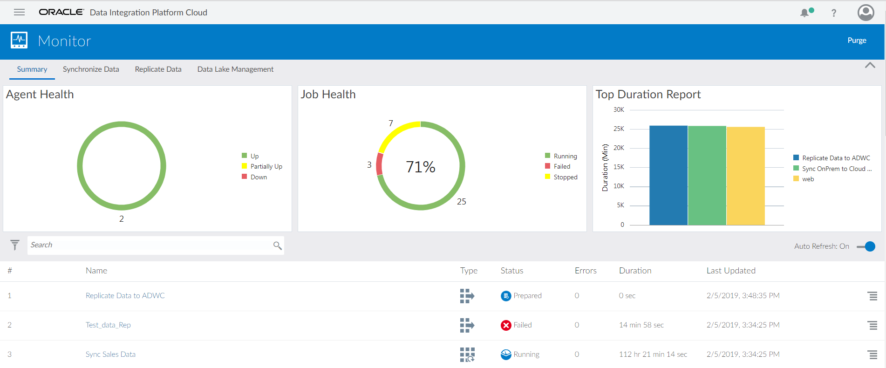
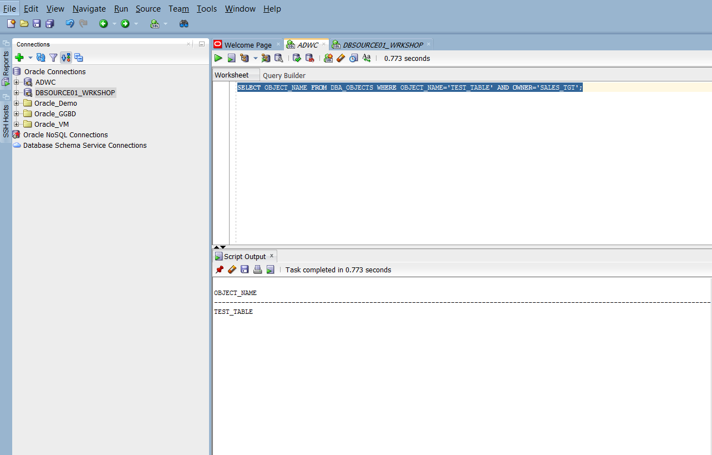

# Lab 1000 - Replicate Date Elevated Task For Autonomous Data Warehouse (ADW)


## Before You Begin

### Introduction
This lab will explain the necessary steps to replicate data from a regular database into and Autonomous Data Warehouse (ADW)

### Objectives
- Create a connection to an Autonomous Data Warehouse
- Execute a Replicate Data elevated task for Autonomous Data Warehouse

### Time to Complete 
Approximately 45 minutes.

### What Do You Need?
Your will need:
- DIPC Instance URL
- DIPC User and Password
- DB information for source system: server name, user/password and service name
- DB information for target system: client credentials file and gguser password
- SQL Developer
- General understanding of RDBMS and data integration concepts


## Log into DIPC Server

### Login into DIPC using Oracle Cloud Services Dashboard

1. In your web browser, navigate to cloud.oracle.com, then click "Sign in".
2. Provide the cloud account; for example,oscnas001 then **\<Enter\>**.

3. Provide your user name and password, then click "Sign In" button. You will land in your Home screen. 
4. Scroll in your home screen until you locate "Data Integration Platform" service and click on it.  
5. Click on the hamburger menu of the DIPC server assigned to you, then click "Data Integration Platform Console". 

You will be navigated to your DIPC server Home page. 


### Login into DIPC using direct URL

1. Open a browser window an provide your DIPC server URL. The URL will be provided by the instructor and will look like this one "https://osc132657dipc-oscnas001.uscom-central-1.oraclecloud.com/dicloud"
2. Provide your user name and password, then click "Sign In" button. 
You will be navigated to your DIPC server Home page.


## Create Connections and Review Catalog
1. You should be logged into DIPC, if that is NOT the case, log in.
2. For synchronization jobs we will need a CDB (Container DB) connection to our DB. In the home page scroll right on the "Get started" panel and click the “Create" button in the "Connection” box. 
3.	Enter the following information:
    - Name: SRC_CDB
    - Description: CDB User for Source DB
    - Agent: **\<REMOTE_AGENT\>**
    - Type: Oracle CDB
    - Hostname: **\<SOURCE_DB_NAME\>**
    - Port: 1521
    
    - Username: C##GGSRC
    - Password: Welcome#123
    - Service Name: **\<CDB_SOURCE_SERVICE_NAME\>**
    ```
    where:
        <REMOTE_AGENT> - Select the DIPC agent you created
        <SOURCE_DB_NAME> - Name of the source database server. This have been provided in your environment page; look for entry SOURCE_DB_NAME
        <CDB_SOURCE_SERVICE_NAME> - CDB Service name string for the source database server. This have been provided in your environment page; look for entry CDB_SOURCE_SERVICE_NAME
    ```
4. Click "Test Connection" button and when the test is successful click "Save" button. You will be navigated to the "Catalog" screen.

5. Open the drop-down menu from the top far right corner and then select “Connection”.

6. Enter the following information:
    - Name: SALES_SRC
    - Description: Sales OLTP Source Data
    - Agent: **\<REMOTE_AGENT\>**
    - Type Oracle: selecting Oracle will expand the Connection Settings
    - Hostname: **\<SOURCE_DB_NAME\>**
    - Port: 1521
    
    - Username: SALES_SRC
    - Password: Welcome#123
    - Service Name: **\<SOURCE_DB_SERVICE_NAME\>**
    - Schema Name: SALES_SRC (Default) – When you try to select the schema, you are testing the connection at the same time
    - CDB Connection: SRC_CDB
    ```
    where:
        <REMOTE_AGENT> - Select the DIPC agent you created 
        <SOURCE_DB_NAME> - Name of the source database server. This have been provided in your environment page; look for entry SOURCE_DB_NAME
        <SOURCE_DB_SERVICE_NAME> - Service name string for the source database server. This have been provided in your environment page; look for entry SOURCE_DB_SERVICE_NAME
    ```

7. Click "Test Connection" button and when the test is successful click "Save" button. 
8.	Now, we are going to create the target connection for Autonomous Data Warehouse. Open the drop-down menu from the top far right corner and then select “Connection”.


9.	Enter the following information:
    - Name: ADWC_TRG 
    - Description: Connection for ADWC Target
    - Agent: **\<REMOTE_AGENT\>**
    - Type : Oracle Autonomous Data Warehouse Cloud
    - Username: GGADMIN 
    - Password: Wel_Come#123
    
    - Credential File: **\<CREDENTIAL_FILE\>**
    - Connection URL: **\<CONNECTION_URL\>**
    - Service Name: dipcadw_low
    - Schema Name: SALES_TRG  (Default)
    ```
    where:
        <REMOTE_AGENT> - Select the DIPC agent you created 
        <CREDENTIAL_FILE> - Select the ADW credential file (ZIP) you downloaded previously. This will populate the drop down on "Service Name" field.
        <CONNECTION_URL> - a URL will automatically appear after selecting the service.  
    ```

10. Click "Test Connection" button and when the test is successful click "Save" button.


## Create Replicate Data Elevated Task
1.	Connections have been defined. We are ready to create and execute our “Replicate Data” elevated task. From the top bar, open the drop-down menu from the top far right corner and then select “Replicate Data” 

 

2.	Provide the following information and click on "Design" button:
    - Name: Replicate Data to ADWC
    - Identifier: Replicate Data to ADWC  
    - Description: Replicate Data to ADWC 

    **Note: If you run into any issues when trying to select a Connection refresh the page manually. The Schemas may take some time to appear as well, this is expected.**

     
    
3. Now provide the Source Schema connection in the Connection drop down box

     

4. Next in the schemas tab select the source schema: SALES_SRC

     

5. Same way now select the target and target ADWC connection in the Connection drop down box

     

6. Now in the Schemas/Topics tab select the target schema : SALES_TRG and click Save & Run

     
7. After this you should be able to see the Job created in the Monitor Section in DIPC console

     
8. Drilldown on the job to see details

     

## Testing the Data Replication from Source to ADWC Target

1. If you log in to the compute instance where the DIPC agent is configured. You can find the Goldengate Processes created for
   Replicate data task.

     

2. On the target ADWC there are no tables with the name 'TEST_TABLE'. We can check that with the below command
    ```
    SELECT OBJECT_NAME FROM DBA_OBJECTS WHERE OBJECT_NAME='TEST_TABLE' AND OWNER='SALES_TGT';
    ```

      

3. Now lets log in to the source DB and create a table and see it getting replicated.    

     

4. These changes are captured by the extract

     

5. The should appear in the ADWC target :

     

6. I will insert one record to the new table at the source Database and then update it.

     

7. Changes will appear in the target ADWC 

     

8. We can go to the Monitor section in the DIPC Console and go to the job and see the statistics in the cosole

     


## Summary
You have now successfully completed the Hands-on Lab, and have successfully performed an Data Replication between Oracle Database as Source and Oracle ADWC as Target through Oracle’s Data Integration Platform Cloud.

## References

Using DIPC for replicating to ADWC below link as the reference :

https://docs.oracle.com/en/cloud/paas/data-integration-platform-cloud/using/replicate-data-oracle-autonomous-data-warehouse-cloud.html

