# Lab 1000 - Replicate Date Elevated Task For Autonomous Data Warehouse


## Before You Begin

### Objectives
- Review how to create connections
- Review how to execute a Replicate Data elevated task for Autonomous Data Warehouse

### Time to Complete 
Approximately 60 minutes.???

### What Do You Need?
Your will need:
- Oracle Managed DIPC Instance URL
- DIPC User and Password
- DB information for source system: server name, user/password and service name
- DB information for target system: client credentials file, admin user password and service names
- SQL Developer
- General understanding of RDBMS and data integration concepts

## Configure Oracle Autonomous Data Warehouse Cloud for Replication
In the Oracle Autonomous Data Warehouse Cloud database, complete the following tasks:

1. Oracle Autonomous Data Warehouse Cloud has a pre-existing database user created for Oracle GoldenGate called ggadmin. The ggadmin user has been granted the right set of privileges for Oracle GoldenGate Replicat to work. By default, this user is locked. To unlock the ggadmin user, connect to your Oracle Autonomous Data Warehouse Cloud database as the ADMIN user using any SQL client tool.

    In SQL Developer 18.3 and higher in the Connection Type field select the value Cloud Wallet that allows you to enter a credentials file. SQL Developer then presents a list of the available connections in the Service field (the connections are included in the credentials files).

    If your application provides support for wallets or provides specific support for an Autonomous Data Warehouse connection,for example, Oracle SQL Developer, Oracle recommends that you use that type of connection.

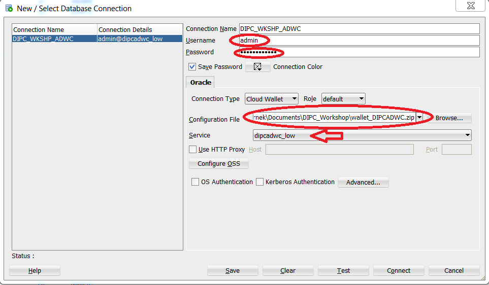

2. Run the alter user command to unlock the ggadmin user and set the password for it.
    ```
    alter user ggadmin identified by <password> account unlock;
    ```

## Obtain Oracle Autonomous Data Warehouse Cloud client credentials file.

To establish connection to your Oracle Autonomous Data Warehouse Cloud database, you can download the client credentials file from the Oracle Autonomous Data Warehouse Cloud service console.

    Note: If you do not have administrator access to Oracle Autonomous Data Warehouse Cloud, you should ask your 
    service administrator to download and provide the client credentials file to you.

1. Log into your Oracle Autonomous Data Warehouse Cloud account.
2. From the Instance page, click the menu option for the Oracle Autonomous Data Warehouse Cloud instance and select Service Console.
3. Log into the service console using the admin username and its associated password.
4. In the service console, click the Administration tab.
5. Click Download Client Credentials.
6. Enter a password to secure your client credentials file and click Download.
7. Save the client credentials file to your local system.

The client credentials file contains the following files:
- cwallet.sso
- ewallet.p12
- keystore.jks
- ojdbc.properties
- sqlnet.ora
- tnsnames.ora
- truststore.jks

You refer to the sqlnet.ora and tnsnames.ora files while configuring Oracle Data Integration Platform Cloud to work with Oracle Autonomous Data Warehouse Cloud.

## Configure Oracle Data Integration Platform Cloud for replication.

Complete the following tasks in the system where ADIPC agent which will be used to connect to ADWC in configured, In this Lab we will be using a compute instance COMPUTE_DIPC02 to configure the DIPC agent:

1. Transfer the client credentials file that you downloaded from Oracle Autonomous Data Warehouse Cloud to your compute instance


2. In the compute instance, unzip the client credentials file into a new directory. For example, /home/oracle/adwc_credentials. This will be your key directory

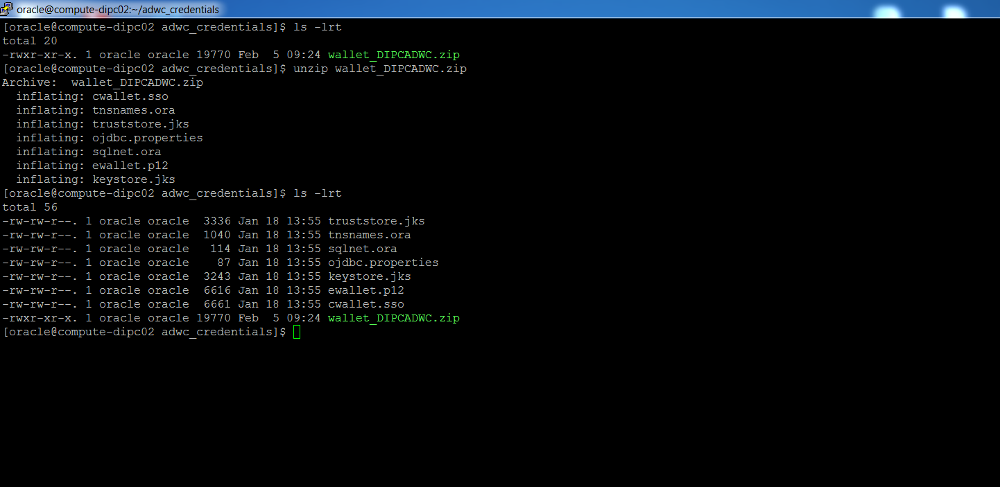

3. To configure the connection details, We need to create the tns files in the DIPC agent. Copy sqlnet.ora and tnsnames.ora files from the client credentials to /home/oracle/dicloud/dicloud/oci location

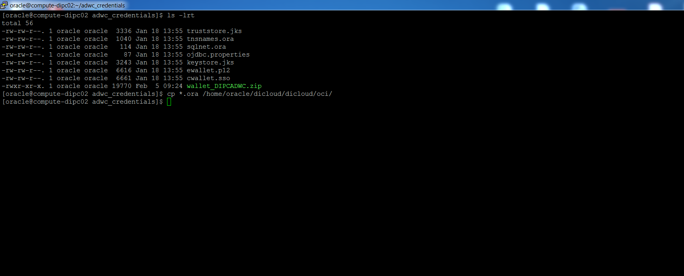

4. Edit the tnsnames.ora file in the /home/oracle/dicloud/dicloud/oci location to include the connection details that is available in the tnsnames.ora file in your key directory (the directory where you unzipped the client credentials file downloaded from Oracle Autonomous Data Warehouse Cloud).

```
Note: The tnsnames.ora file provided with the client credentials file contains three database service names 
identifiable as:
ADWC_Database_Name_low
ADWC_Database_Name_medium
ADWC_Database_Name_high

For Oracle GoldenGate replication, use ADWC_Database_Name_low
```

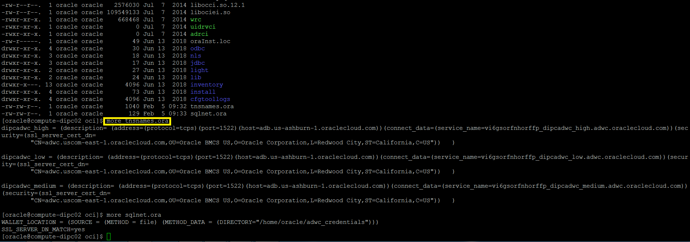

5. Edit this sqlnet.ora file to include your key directory.

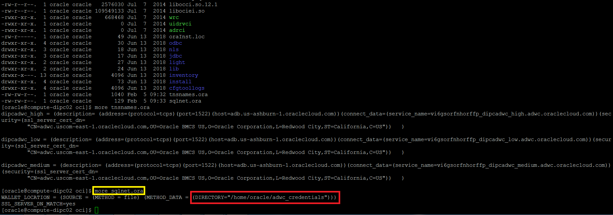


## Logging Into Oracle Cloud Instance

1. In your web browser, navigate to cloud.oracle.com, then click Sign in.
2. Provide the cloud account: oscnas001 then \<Enter\>

3. Provide your user name and password, then click Sign In. 

Click Services or Go to Dashboard to access My Oracle Services.


## Create Connections and Review Catalog

1. Log into your Workshop DIPC Server.

2. For synchronization jobs we will need a CDB (Container DB) connection to our DB. In the Home Page click the “Create" button in the "Connection” box from top section. 

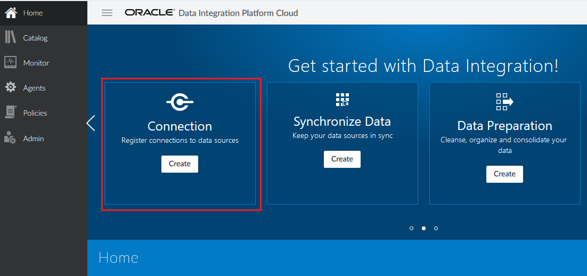

3.	Enter the following information
    - Name: SRC_CDB
    - Description: CDB User for Source DB
    - Agent: **\<AGENT\>**
    - Type: Oracle CDB
    - Hostname: **\<SOURCE_DB_NAME\>**
    - Port: 1521
    - Username: C##GGSRC
    - Password: Wel_Come#123
    - Service Name: **\<CDB_SOURCE_SERVICE_NAME\>**

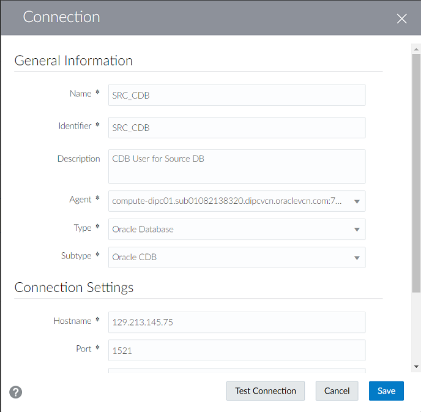 

    ```
    where:
        <AGENT> - Select the DIPC agent you created 
        <SOURCE_DB_NAME> - Name of the source database server. This have been provided in your environment page; 
        look for entry SOURCE_DB_NAME
        <CDB_SOURCE_SERVICE_NAME> - CDB Service name string for the source database server. This have been provided
        in your environment page; look for entry CDB_SOURCE_SERVICE_NAME
    ```
4. Click "Test Connection" button and when the test is successful click "Save" button.

5. Open the drop-down menu from the top far right corner and then select “Connection”. 


6. Enter the following information:
    - Name: SALES_SRC
    - Description: Sales OLTP Source Data
    - Agent: **\<AGENT\>**
    - Type Oracle: selecting Oracle will expand the Connection Settings 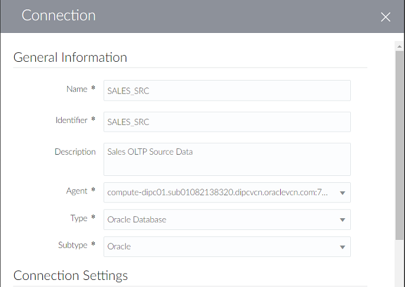
    - Hostname: **\<SOURCE_DB_NAME\>**
    - Port: 1521
    - Username: SALES_SRC
    - Password: Wel_Come#123
    - Service Name: **\<SOURCE_DB_SERVICE_NAME\>**
    - Schema Name: SALES_SRC (Default) – When you try to select the schema, you are testing the connection at the same time
    - CDB Connection: SRC_CDB 
    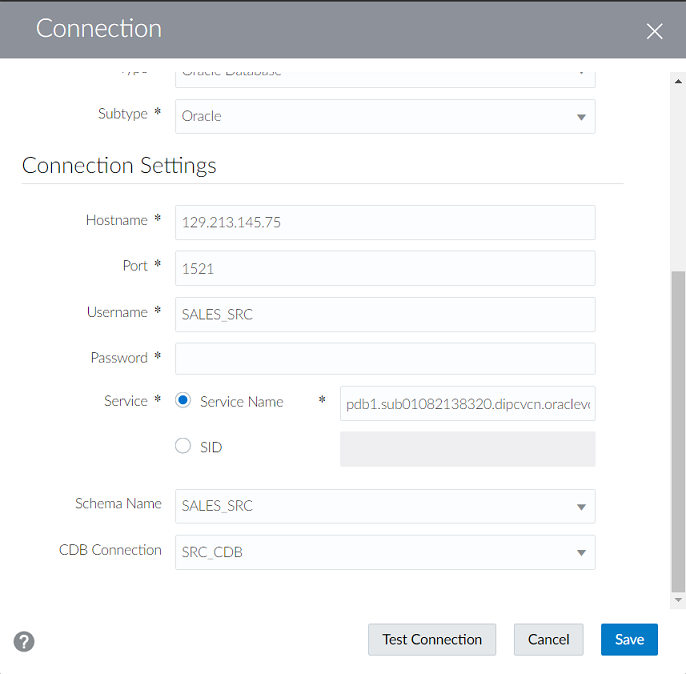
    ```
    where:
        <AGENT> - Select the DIPC agent you created 
        <SOURCE_DB_NAME> - Name of the source database server. This have been provided in your environment page;
        look for entry SOURCE_DB_NAME
        <SOURCE_DB_SERVICE_NAME> - Service name string for the source database server. This have been provided 
        in your environment page; look for entry SOURCE_DB_SERVICE_NAME
    ```
7. Click "Test Connection" button and when the test is successful click "Save" button. DIPC will create the connection and will harvest the entities in the schema. You will be navigated to the Catalog and you will see, after some time, the connection you just created and the entities in that schema
    
    **Note: Data Entities are harvested and profiled at the time the connection is created, their popularity is also calculated by reviewing the DB query logs. This process may take some time (5 minutes or so), the Catalog will show a message when new updates are available**

    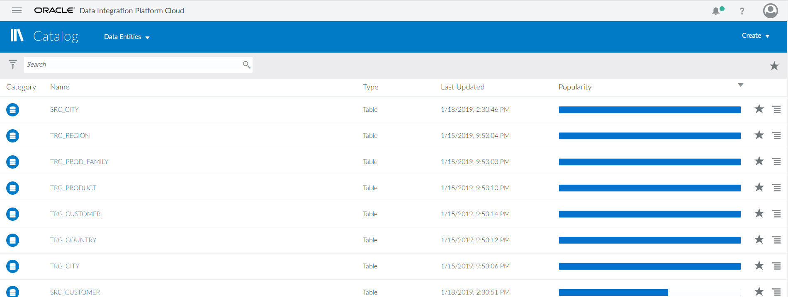

8.	Now, we are going to create the target connection for Autonomous Data Warehouse. Open the drop-down menu from the top far right corner and then select “Connection”  

9.	Enter the following information:
    - Name: ADWC_TRG 
    - Description: Connection for ADWC Target
    - Agent: **\<AGENT\>**
    - Type : Oracle Autonomous Data Warehouse Cloud
    - Username: GGADMIN 
    - Password: Wel_Come#123
    - Credential File: **\<CREDENTIAL_FILE\>**
    - Connection URL: **\<CONNECTION_URL\>**
    - Service Name: dipcadw_low
    - Schema Name: SALES_TRG  (Default)
    ```
    where:
        <AGENT> - Select the DIPC agent you created 
        <CREDENTIAL_FILE> - Select the ADW credential file (ZIP) you downloaded previously. This will populate the drop down on "Service Name" field.
        <CONNECTION_URL> - a URL will automatically populate after selecting the service.  
    ```
    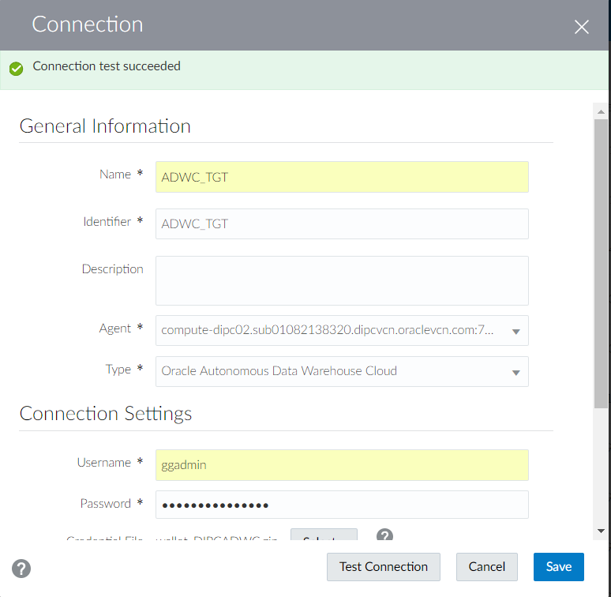

    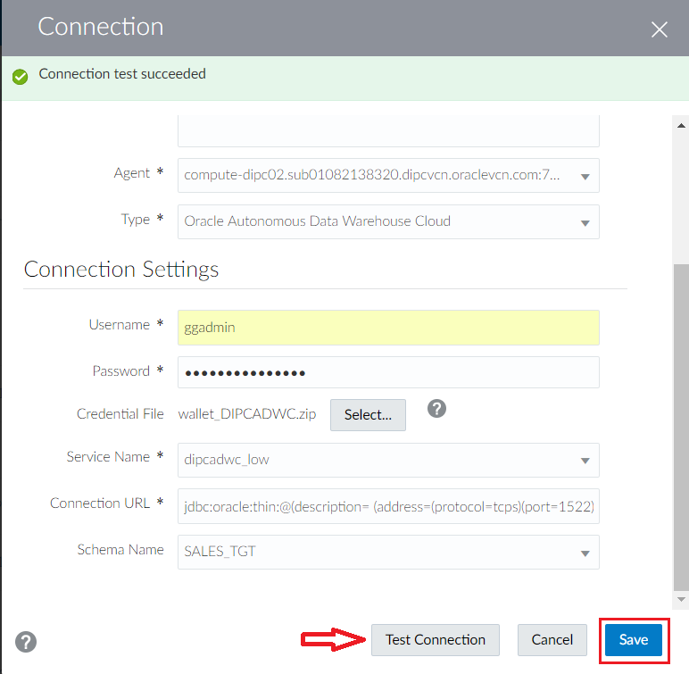

10. Click "Test Connection" button and when the test is successful click "Save" button. DIPC will create the connection and will harvest the entities in the schema. You will be navigated to the Catalog and you will see, after some time, the new connection you just created and the entities in that schema (if any)


## Create Replicate Data Elevated Task
1.	Connections have been defined. We are ready to create and execute our “Replicate Data” elevated task. From the top bar, open the drop-down menu from the top far right corner and then select “Replicate Data” 

 

2.	Provide the following information and click on "Design" button:
    - Name: Replicate Data to ADWC
    - Identifier: Replicate Data to ADWC  
    - Description: Replicate Data to ADWC 

    **Note: If you run into any issues when trying to select a Connection refresh the page manually. The Schemas may take some time to appear as well, this is expected.**

    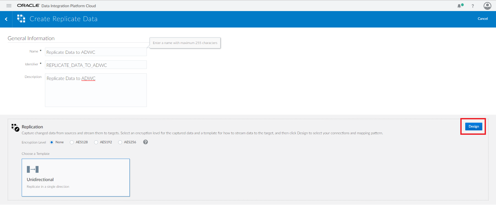 
    
3. Now provide the Source Schema connection in the Connection drop down box

     

4. Next in the schemas tab select the source schema: SALES_SRC

     

5. Same way now select the target and target ADWC connection in the Connection drop down box

     

6. Now in the Schemas/Topics tab select the target schema : SALES_TRG and click Save & Run

    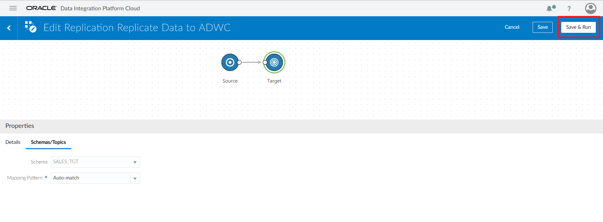 

7. After this you should be able to see the Job created in the Monitor Section in DIPC console
    
     

     

## Testing the Data Replication from Source to ADWC Target

1. If you log in to the compute instance where the DIPC agent is configured. You can find the Goldengate Processes created for
   Replicate data task.

     

2. On the target ADWC there are no tables with the name 'TEST_TABLE'. We can check that with the below command
    ```
    SELECT OBJECT_NAME FROM DBA_OBJECTS WHERE OBJECT_NAME='TEST_TABLE' AND OWNER='SALES_TGT';
    ```
    
      

3. Now lets log in to the source DB and create a table and see it getting replicated.    

     

4. These changes are captured by the extract

    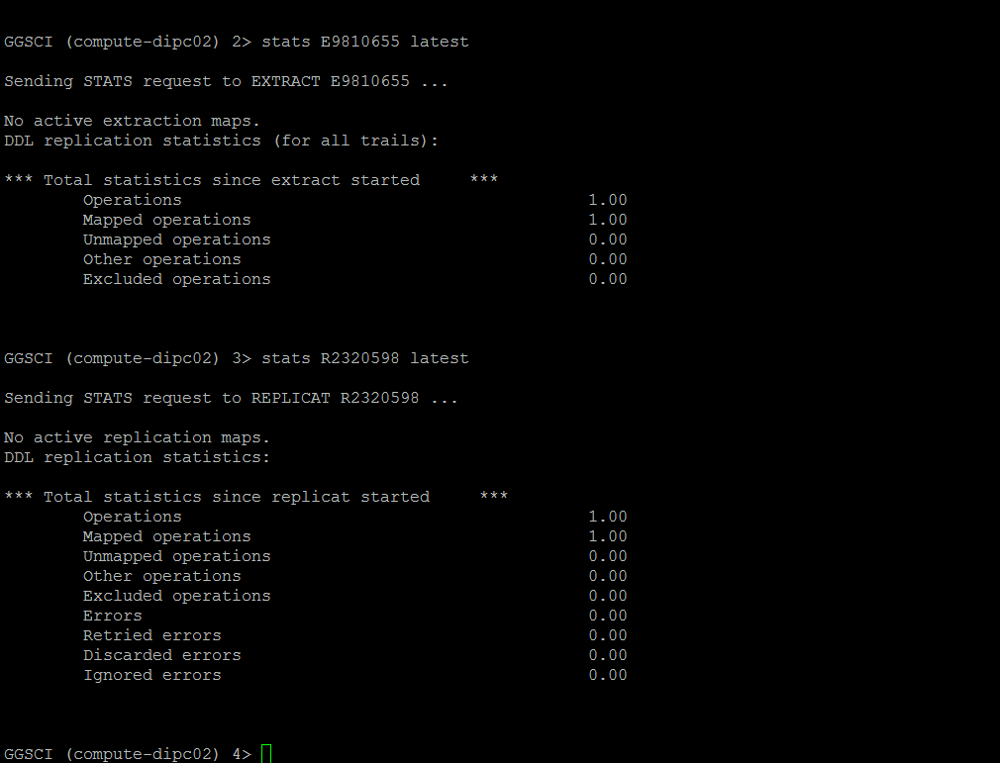 

5. The should appear in the ADWC target :

     

6. I will insert one record to the new table at the source Database and then update it.

     

7. Changes will appear in the target ADWC 

     

8. We can go to the Monitor section in the DIPC Console and go to the job and see the statistics in the cosole

    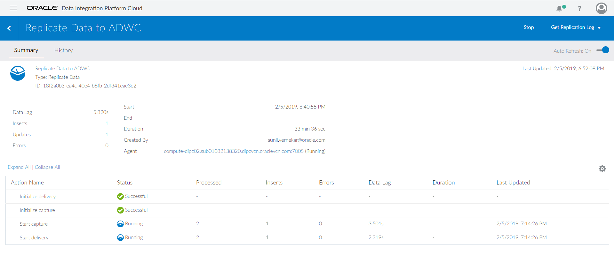 


```
Using DIPC for replicating to ADWC below link as the reference :
https://docs.oracle.com/en/cloud/paas/data-integration-platform-cloud/using/replicate-data-oracle-autonomous-data-warehouse-cloud.html
```

MAGU: If we explained how to connect using SQLDeveloper, shouldn't we use it to do teh testing? (create table, update row, etc.) and use DIPC monitoring to see the # of rows inserted, deleted, updated, etc. instead of GGSCI