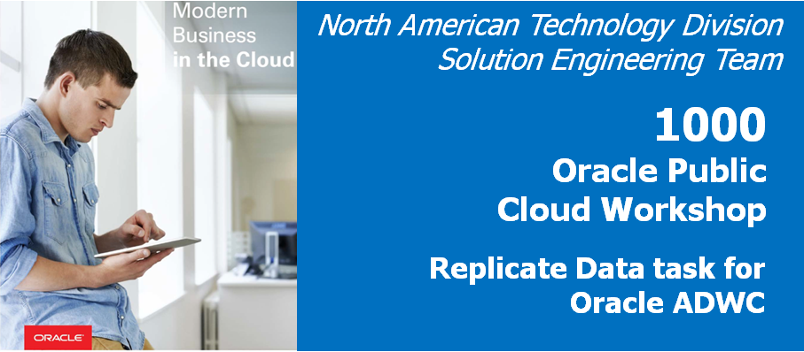
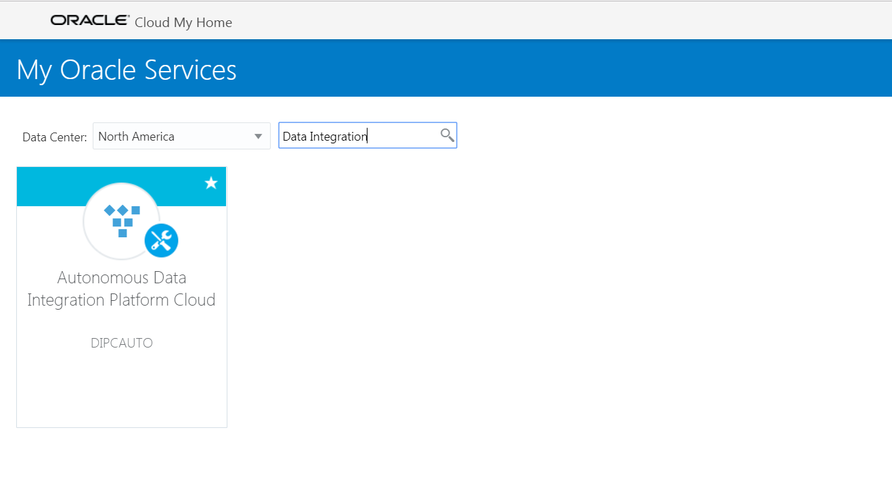
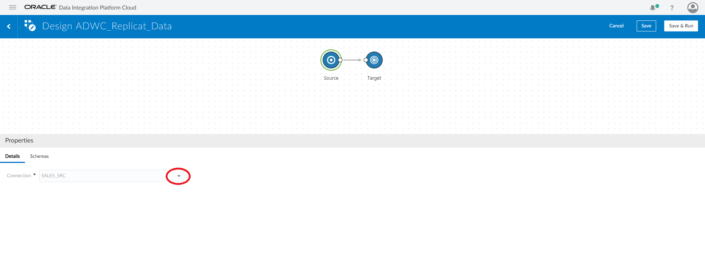
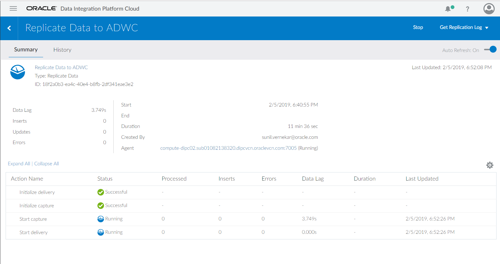
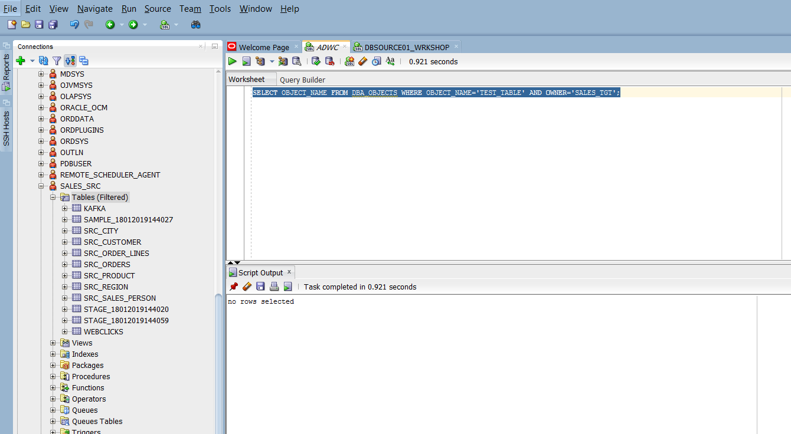
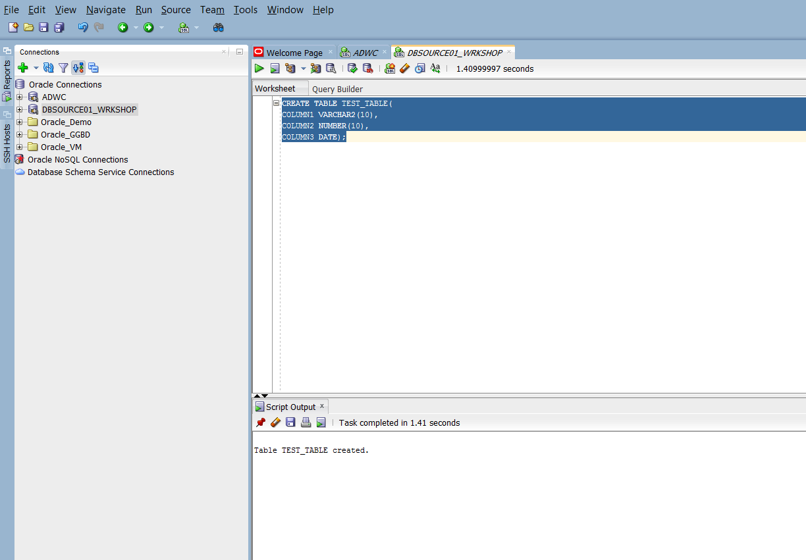
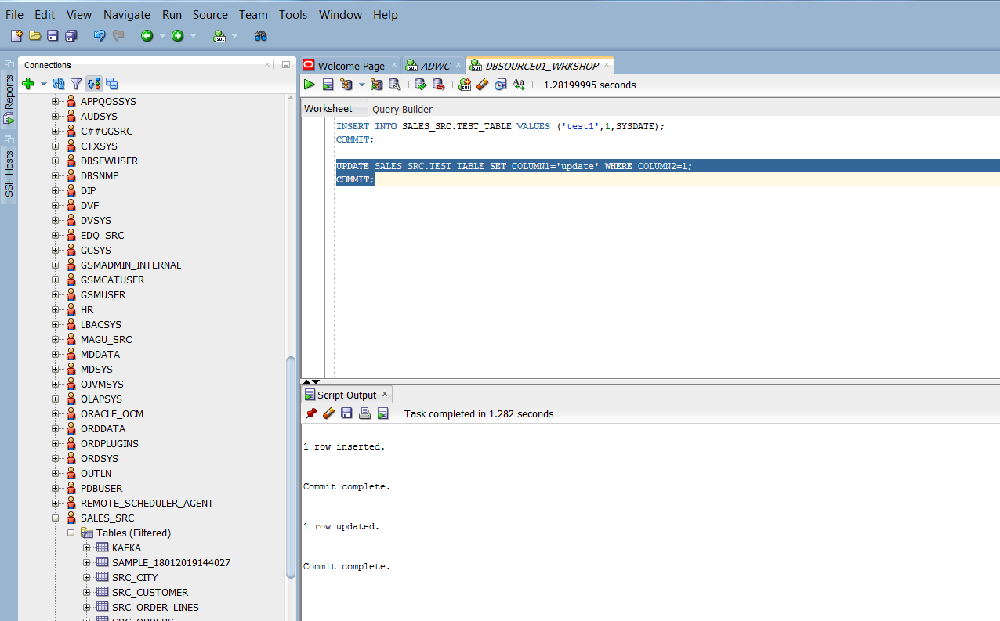
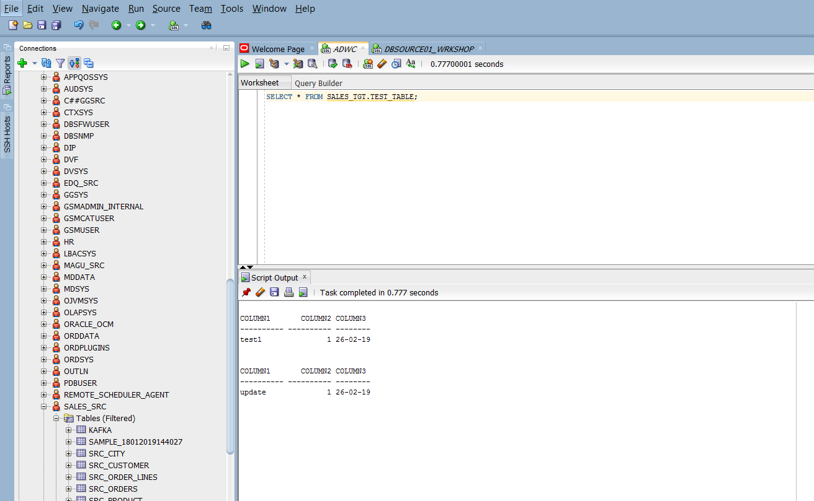

# Lab 1300 - Replicate Data - Oracle to Kafka


## Before You Begin

### Objectives
- Review how to create connections
- Review how to execute a Replicate Data Task between Oracle and Kafka

### Time to Complete 
Approximately 60 minutes.

### What Do You Need?
Your will need:
- Oracle Managed DIPC Instance URL
- DIPC User and Password
- DB information for source system: server name, user/password and service name
- COnfluent Kafka Installation 
- General understanding of Kafka Processes and RDBMS 

## Configure Source Database (oracle) for Replication
In the Oracle database, complete the following tasks:

1. Create a Oracle 12c CDB database and inside it create a PDB. We need to have a Schema created for which we will configure the Replication. In this case we will use SALES_SRC Schema under PDB1. We will Replicate a table called as Kafka under SALES_SRC schema.

## Configure Destination (Kafka) for Replication
1. Install Confluent Kafka 5.1 on the target box. Kafka is basically a stream processing Software. Once the Installation is completed, Start the following processes within Kafka
(i) Zookeeper 
(ii) Kafka Server
(iii) Create Topics in kafka which will be used to store the Data coming from Oracle Database(Source)


## Configure Oracle Data Integration Platform Cloud for replication.
Complete the following tasks in the system where ADIPC agent which will be used to connect to ADWC in configured, In this Lab we will be using a compute instance COMPUTE_DIPC01 to configure the DIPC agent:


## Log into DIPC Server

### Login into DIPC using Oracle Cloud Services Dashboard

1. In your web browser, navigate to cloud.oracle.com, then click Sign in.

2. Provide the cloud account: orasenatdpltintegration02 then **{Enter}**

3. Provide your user name and password, then click "Sign In" button Or You can log in with Oracle SSO. You will land in the Dasboard screen.


4. In the Dasboard search for  "Autonomous Data Integration Platform Cloud" and click on the service.
 
 

5. Click on the hamburger menu of the DIPC server assigned to you, then click "Data Integration Platform Console" ![]

 

You will be navigated to your DIPC server Home page. 


## Create Connections For Oracle Database (Source) and Kafka(Target)
1. Log into your Workshop DIPC Server.
2. Navigate to Catalog tab and Click on Create and Select 'Connection'

 

3.	Enter the following information
    - Name: SRC_CDB
    - Description: CDB User for Source DB
    - Agent: **{LOCAL_AGENT}**
    - Type: Oracle CDB
    - Hostname: **{SOURCE_DB_NAME}**
    - Port: 1521
    - Username: C##GGSRC
    - Password: Wel_Come#123
    - Service Name: **{CDB_SOURCE_SERVICE_NAME}**

        
    ```
    where:
        {LOCAL_AGENT} - Select the local DIPC agent 
        {SOURCE_DB_NAME} - Name of the source database server. This have been provided in your environment page; look for entry SOURCE_DB_NAME
        {CDB_SOURCE_SERVICE_NAME} - CDB Service name string for the source database server. This have been provided in your environment page; look for entry CDB_SOURCE_SERVICE_NAME
    ```
4. Click "Test Connection" button and when the test is successful click "Save" button.
5. Open the drop-down menu from the top far right corner and then select “Connection”. 
6. Enter the following information:
    - Name: SALES_SRC
    - Description: Sales OLTP Source Data
    - Agent: **{LOCAL_AGENT}**
    - Type Oracle: selecting Oracle will expand the Connection Settings 
    - Hostname: **{SOURCE_DB_NAME}**
    - Port: 1521
    - Username: SALES_SRC
    - Password: Welcome#123
    - Service Name: **{SOURCE_DB_SERVICE_NAME}**
    - Schema Name: SALES_SRC (Default) – When you try to select the schema, you are testing the connection at the same time
    - CDB Connection: SRC_CDB 
    
    ```
    where:
        {LOCAL_AGENT} - Select the local DIPC agent 
        {SOURCE_DB_NAME} - Name of the source database server. This have been provided in your environment page; look for entry SOURCE_DB_NAME
        {SOURCE_DB_SERVICE_NAME} - Service name string for the source database server. This have been provided in your environment page; look for entry SOURCE_DB_SERVICE_NAME
    ```
7. Click "Test Connection" button and when the test is successful click "Save" button. DIPC will create the connection and will harvest the entities in the schema. You will be navigated to the Catalog and you will see, after some time, the connection you just created and the entities in that schema
    **Note: Data Entities are harvested and profiled at the time the connection is created, their popularity is also calculated by reviewing the DB query logs. This process may take some time (5 minutes or so), the Catalog will show a message when new updates are available**
    
8. Click on entity “SRC_CUSTOMER” to drill down in it and look at the information DIPC brought in  
If you would like to associate a tag or a contact to this entity, click on “Edit” button on the top right corner.
9. Click on the “Metadata” tab on top  
    DIPCS shows attributes, primary keys, data types and some sample values of the selected entity. If you click in one of the attributes, profiling information will be shown on the right side of the screen.   
10.	Click on the “Data” tab on top  
11.	Click on the back icon, located on the top left corner (left of the entity name) to go back to the Catalog
12.	In the catalog you can use the drop-down menu located at the top to select the type of object that will be shown 
13.	It is also possible to use the filter to search for a specific object 
14.	Now, we are going to create the target connection. Open the drop-down menu from the top far right corner and then select “Connection”  
15.	Enter the following information:
    - Name: SALES_TRG 
    - Description: Sales OLTP Replicated Data
    - Agent: **{LOCAL_AGENT}**
    - Type Oracle – selecting Oracle will expand the Connection Settings
    - Hostname: **{TARGET_DB_NAME}**
    - Port: 1521
    - Username: SALES_TRG 
    - Password: Welcome#123
    - Service Name: **{TARGET_DB_SERVICE_NAME}**
    - Schema Name: SALES_TRG  (Default)
    ```
    where:
        {LOCAL_AGENT} - Select the local DIPC agent 
        {TARGET_DB_NAME} - Name of the target database server. This have been provided in your environment page; look for entry TARGET_DB_NAME
        {TARGET_DB_SERVICE_NAME} - Service name string for the target database server. This have been provided in your environment page; look for entry TARGET_DB_SERVICE_NAME
    ```
    
16. Click "Test Connection" button and when the test is successful click "Save" button. DIPC will create the connection and will harvest the entities in the schema. You will be navigated to the Catalog and you will see, after some time, the new connection you just created and the entities in that schema (if any)


## Create Synchronize Data Elevated Task
1.	Connections have been defined. We are ready to create and execute our “Synch Data” elevated task. From the top bar, open the drop-down menu from the top far right corner and then select “Synchronize Data” 
 
2.	Provide the following information:
    - Name: Sync Sales Data
    - Description: Sync Schemas - SALES_SRC to SALES_TRG  
    - Source – Connection: SALES_SRC
    - Source – Schema: SALES_SRC – The default schema will be automatically selected. Leave it
    - Target – Connection: SALES_TRG 
    - Target – Schema: SALES_TRG  – The default schema will be automatically selected. Leave it
    - Advanced – Include Initial Load: SELECTED
    - Advanced – Include Replication: SELECTED
    The “Advanced Options” allow you to optionally enable or disable the initial load and/or the on-going schema replication.
    **Note: If you run into any issues when trying to select a Connection refresh the page manually. The Schemas may take some time to appear as well, this is expected.**
    
3.	Next click on “Configure Entities” on the top bar to filter the objects that will be transferred from source into target. 
4.	The “Configure Entities” screen allows you to create include or exclude rules to define precisely which database objects will be moved over to the target schema. By default, all data entities are transferred. Enter SRC_C* in the "Rules" field and click on “-” button.   
5.	Please note how the "Selected Data Entities" list changes when the rule is applied. Select the hamburger menu   (located on the right side of the row) of the rule you just created and select “Delete". You should end up with the original rule only
6.	Click on “Save & Run” button on the top right to execute the task 
7.	A message will appear in the notification bar and you will be navigated to the “Monitor” screen. 
8.	The job will automatically appear within the Jobs page. This may take some time  
Auto-refresh is on, statuses will be updated frequently.
As the job executes, the Initial Load process is created in ODI while DIPC configures OGG for the Source Capture and Target Delivery.


## Review Task Execution

### In ODI Console (Optional)
The Initial Load process uses Data Pump and can be monitored within ODI Console. 

1.	Click on the picture icon located on the top right corner of the screen and then select “Open ODI”   
2.	Click on “Proceed” button   
3.	On the hierarchical panel on the left select “Runtime > Sessions > Sessions”. Then select the row. 
4.	Now click on the “View” icon (sunglasses located on top left corner). This will open a tab on the right side with information about the executed sessions. 
5.	Click on the session name to drill down and look at more detail 
6.	Scroll down to see the detailed steps. When finished, you can close the browser tab with ODI Console 


### Review Job in DIPC
1.	You should be in the “Jobs” screen. Click on the Job to see the Job Details. The Initial load Action will show Successful after a little while
 
2.	Once done, the “Initial Load” Action can be expanded to review the various steps underneath
 
3.	Click on “Procedure:Initial load_PROC:DBLINK_DATAPUMP” to review the code generated by DIPC for the Initial Load. 
 
4.	Click Done when you’ve completed the code review
5.	Close “Initial Load” action. Let’s review what else has been created. You should see 5 Actions

DIPC has created and orchestrated the initial load and the data synchronization processes between the source (for example, an OLTP system) and the target (for example, an operational data store, stand-by copy, etc.) -- (additional details can be seen in the GG logs as well as within ODI Studio)


### Verify Data in Source and Target DBs (Optional)
Up until this point, we have monitored the job within DIPC but it would nice to see the data in both source and target to verify that they are the same. For such task, we will use SQL Developer; please refer to Appendix 3 to learn how to create connections against the workshop databases.
1.	Start SQL Developer. On the connections panel, select your source database (WS - SALES_SRC) and click on the plus (+) sign to open the connection 

2.	Once opened, copy and paste the following statements in the panel on the right:
    ```
    SELECT COUNT(*) AGE_GROUP FROM SRC_AGE_GROUP;
    SELECT COUNT(*) CITY FROM SRC_CITY;
    SELECT COUNT(*) CUSTOMER FROM SRC_CUSTOMER;
    SELECT COUNT(*) ORDER_LINES FROM SRC_ORDER_LINES;
    SELECT COUNT(*) ORDERS FROM SRC_ORDERS;
    SELECT COUNT(*) PRODUCTS FROM SRC_PRODUCT;
    SELECT COUNT(*) REGION FROM SRC_REGION;
    SELECT COUNT(*) SALES_PERSON FROM SRC_SALES_PERSON;
    ```

3.	Execute the statements by clicking on the “Run script” icon (second icon from left to right on the icon bar; right-ponting green arrow head on top of a page)
4.	This will show all entities count on the results panel (lower section) 

5.	Repeat steps 1 through 4 for connection “WS - SALES_TRG ”     

This will show that the count in both data bases is exactly the same.


### Verify GG processes (Optional)
If you want to take a look and verify that the GG processes (extract and replicat) are running, these are the steps:

1.	Open an SSH session into the DIPC server; please refer to Appendix 1 to learn how to establish a SSH session against the DIPC server
2.	Execute: source .ggsetup 
3.	Execute: /u01/app/oracle/suite/gghome/ggsci 
4.	You are now in GG console, execute: info all 
Now you have verified that both Extract and Replicat are running. Exit from GGSCI


## Monitor Data Changes 

We are going to apply some changes to the source DB and verify how our “Synchronize Data” task takes care of these changes and replicates them to the target.

1.	Go to your SQL Developer and expand “WS - SALES_SRC” connection and its tables.

2.	Select “SRC_CUSTOMER” table
3.	On the right panel, select “Data” tab

4.	Click on “Insert Row” icon and provide the following data:
    - CUSTID: 1000
    - DEAR: 0
    - LAST_NAME: Parker
    - FIRST_NAME: Peter
    - ADDRESS: 11000 Smith Street
    - CITY_ID: 12
    - PHONE: (510) 556 4879
    - AGE: 48
    - SALES_PERS_ID: 12 
5.	Click on “Commit” icon to insert the row into the DB (fifth icon from left to right on the icon bar; green checkmark on top of a disk)
6.	Verify the insert in the target. Go to SQL developer and expand “WS - SALES_TRG ” connection and its tables 
7.	Select “SRC_CUSTOMER”  table
8.	On the right panel, select “Data” tab. You will need to scroll all the way down to see the new row 
As data is updated, inserted or deleted from the source the data will be automatically synchronized with the replicated schema by the DIPC Sync Sales Data Job. 
9.	Go back to DIPC, you should be in the detail screen of the Data Synch job
10.	Verify that the screen has auto refresh ON so you will see the changes 
11.	It might take some time. The screen will reflect the insertion in the source 
12.	And the insertion in the target 
13.	Now, we will perform a delete. On your “WS - SALES_SRC” connection (SQL Developer) select “SRC_CUSTOMER” table
14.	On the right panel, select “Data” tab and look for “Peter Parker”, select it.

15.	Click on “delete icon (fourth icon from left to right on the icon bar; red X) 
16.	Click on “Commit” (fifth icon from left to right on the icon bar; green checkmark on top of a disk) icon 
17.	Let’s verify the deletion in the target. On your “WS - SALES_TRG ” connection (SQL Developer) select “SRC_CUSTOMER” table
18.	Look for “Peter Parker”, it will not be there
19.	Go back to DIPC, you should be in the detail screen of the Data Synch job
20.	It might take some time. The screen will reflect the deletion in the source 
21.	And the deletion in the target 
22.	Now let’s perform an update. On your “WS - SALES_SRC” connection (SQL Developer) select “SRC_CUSTOMER” table
23.	On the right panel, select “Data” tab and look for “Paul Brendt”, double click in his age 
24.	Change it to 25 
25.	Click on “Commit” (fifth icon from left to right on the icon bar; green checkmark on top of a disk) icon. This row will be automatically updated on the target as the DIPC Job picks up the change
26.	Let’s verify the update in the target. On your “WS - SALES_TRG ” connection (SQL Developer) select “SRC_CUSTOMER” table
27.	On the right panel, select “Data” tab and look for “Paul Brendt”, his age has change to 25
28.	Go back to DIPC, you should be in the detail screen of the Data Synch job
29.	It might take some time. The screen will reflect the update in the source 
30.	And the update in the target 


## Summary
You have now successfully completed the Hands-on Lab, and have successfully performed an end-to-end data synchronization task through Oracle’s Data Integration Platform Cloud.


Using DIPC for replicating to ADWC
https://docs.oracle.com/en/cloud/paas/data-integration-platform-cloud/using/replicate-data-oracle-autonomous-data-warehouse-cloud.html
