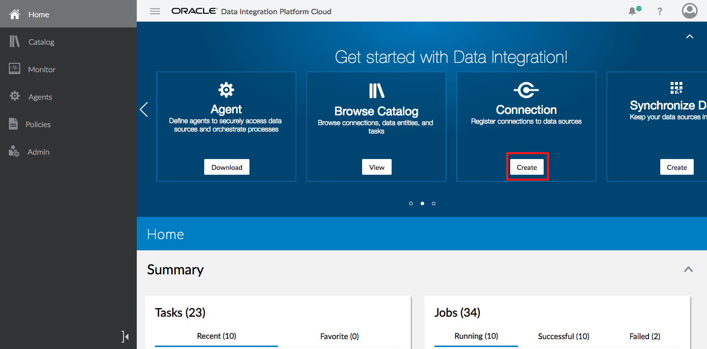
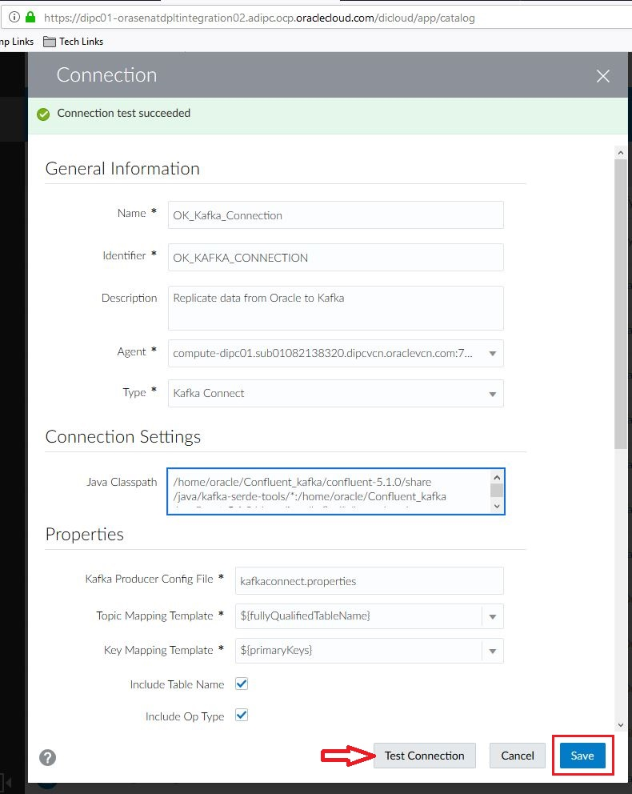
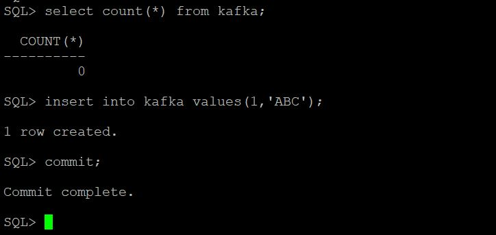

# Lab 1300 - Replicate Data - Oracle to Kafka


## Before You Begin

### Introduction
This labs will guide through the steps required to start a replication stream between an Oracle database and a Kafka queue. The configuration of the Kafka environment is beyond this lab's scope

### Objectives
- Create connection to Kafka
- Execute a Replicate Data Elevated Task between Oracle DB and Kafka

### Time to Complete 
Approximately 60 minutes

### What Do You Need?
Your will need:
- DIPC Instance URL
- DIPC User and Password
- DB information for source system: server name, user/password and service name
- Confluent Kafka Installation 
- General understanding of Kafka Processes and RDBMS 


## Log into DIPC Server

### Login into DIPC using Oracle Cloud Services Dashboard

1. In your web browser, navigate to cloud.oracle.com, then click "Sign in".
2. Provide the cloud account; for example,oscnas001 then **\<Enter\>**.

3. Provide your user name and password, then click "Sign In" button. You will land in your Home screen. 
4. Scroll in your home screen until you locate "Data Integration Platform" service and click on it.  
5. Click on the hamburger menu of the DIPC server assigned to you, then click "Data Integration Platform Console". 

You will be navigated to your DIPC server Home page. 


### Login into DIPC using direct URL

1. Open a browser window an provide your DIPC server URL. The URL will be provided by the instructor and will look like this one "https://osc132657dipc-oscnas001.uscom-central-1.oraclecloud.com/dicloud"
2. Provide your user name and password, then click "Sign In" button. 
You will be navigated to your DIPC server Home page.


## Create Connections 
### Oracle (Source)
## Create Connections
1. You should be logged into DIPC, if that is NOT the case, log in.
2. If "SRC_CDB" connection has been already created, you can skip this section. If not, for the replication elevated task, we will need a CDB (Container DB) connection to our DB. In the home page scroll right on the "Get started" panel and click the “Create" button in the "Connection” box. 
3.	Enter the following information:
    - Name: SRC_CDB
    - Description: CDB User for Source DB
    - Agent: **\<REMOTE_AGENT\>**
    - Type: Oracle CDB
    - Hostname: **\<SOURCE_DB_NAME\>**
    - Port: 1521
    
    - Username: C##GGSRC
    - Password: Welcome#123
    - Service Name: **\<CDB_SOURCE_SERVICE_NAME\>**
    ```
    where:
        <REMOTE_AGENT> - Select the DIPC agent you created
        <SOURCE_DB_NAME> - Name of the source database server. This have been provided in your environment page; look for entry SOURCE_DB_NAME
        <CDB_SOURCE_SERVICE_NAME> - CDB Service name string for the source database server. This have been provided in your environment page; look for entry CDB_SOURCE_SERVICE_NAME
    ```
4. Click "Test Connection" button and when the test is successful click "Save" button. You will be navigated to the "Catalog" screen.

5. Open the drop-down menu from the top far right corner and then select “Connection”.

6. Enter the following information:
    - Name: SALES_SRC
    - Description: Sales OLTP Source Data
    - Agent: **\<REMOTE_AGENT\>**
    - Type Oracle: selecting Oracle will expand the Connection Settings
    - Hostname: **\<SOURCE_DB_NAME\>**
    - Port: 1521
    
    - Username: SALES_SRC
    - Password: Welcome#123
    - Service Name: **\<SOURCE_DB_SERVICE_NAME\>**
    - Schema Name: SALES_SRC (Default) – When you try to select the schema, you are testing the connection at the same time
    - CDB Connection: SRC_CDB
    ```
    where:
        <REMOTE_AGENT> - Select the DIPC agent you created 
        <SOURCE_DB_NAME> - Name of the source database server. This have been provided in your environment page; look for entry SOURCE_DB_NAME
        <SOURCE_DB_SERVICE_NAME> - Service name string for the source database server. This have been provided in your environment page; look for entry SOURCE_DB_SERVICE_NAME
    ```

7. Click "Test Connection" button and when the test is successful click "Save" button. 
8.	Now, we are going to create the target connection for Autonomous Data Warehouse. Open the drop-down menu from the top far right corner and then select “Connection”.


### Kafka(Target)
1.	Now, we are going to create the target connection (for Kafka). Open the drop-down menu from the top far right corner and then select “Connection”  


2.	Enter the following information:
    - Name: OK_Kafka_Connection 
    - Description: Replicate data from Oracle DB to Kafka
    - Agent: **{REMOTE_AGENT}**
    - Type Oracle: Kafka Connect
    - Java ClassPath: dirprm:/home/oracle/Confluent_kafka/confluent-5.1.0/share/java/kafka-serde-tools/*:/home/oracle/Confluent_kafka/confluent-5.1.0/share/java/kafka/*:/home/oracle/Confluent_kafka/confluent-5.1.0/share/java/confluent-common/*
    - Kafka Producer Config file:  kafkaconnect.properties
    - Topic Mapping Template: FullyQualifiedTableName
    - Key Mapping Template: PrimaryKeys
    - Checkboxes: Leave all the checkboxes with default selection
    ```
    where:
        <REMOTE_AGENT> - Select the DIPC agent you created 
    ```
3. Click "Test Connection" button and when the test is successful click "Save" button.

    


## Data Replication Elevated Task
1.	Connections have been defined. We are ready to create and execute our replication task between Oracle and Kafka. From the top bar, open the drop-down menu from the top far right corner and then select "Replicate Data" 


2.	Provide the following information:
    - Name: O2K_Replication
    - Description: Oracle to Kafka Replication


Click the "Design" tab to start designing the source and target functionalities

3.	Click on “Source” and in the "Details" tab select the DB connection we will use (SALES_SRC). 


4.	Click the "Schemas" tab and select SALES_SRC schema; in the text area append ".kafka" to it. You will see on the bottom right corner "# Rule Applied" a confirmation.

  

5.	Click on the "Target" icon;  in the "Details" tab select the Kafka connection that you just created.


6.  Click the "Schemas/Topics" tab and leave the default values as it is. Once this is completed, click on "Save and Run" button at the upper right corner of the screen.


7.	The job will automatically appear within the "Monitor" page. It will be shown like this


Auto-refresh is on, status will be updated frequently.


## Testing Data Replication

1.	Login to The Source PDB Database, Create a table Kafka and Insert one Record in the table



2.	Once the Data Inserted is Committed, you will see one Insert shown in your Job as below.

 

3.	Login to the Kafka Server and Check the Data being listed on the Consumer. Note in the below screenshot, data is in JSON Format.


## Summary
You have now successfully completed the Hands-on Lab, and have successfully performed an Data Replication between Oracle Database as Source and Confluent Kafka as Target through Oracle’s Data Integration Platform Cloud.

## References
1. Downloading Confluent Kafka:
https://www.confluent.io/download/

2. Starting the Zookeeper, kafka Server, Kafka Consumer
https://kafka.apache.org/quickstart
