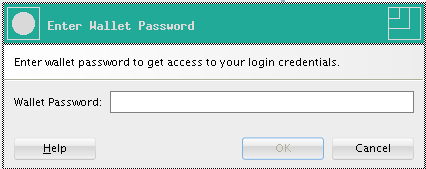

# Lab 900 - MySQL integration

## 8/4/2018

### Lab Notes

- Intent of this lab is to show the various engines within DIPC that do various types of processing like ODI for batch ELT processing and GoldenGate for streaming replication processing.
- This helps to communicate the value of DIPCS by showing the power of the individual "engines" that are part of DIPCS.
- This "feature" will not be included in ADIPCS per PM.   Some determination will need to be made with ADIPCS is released if it makes sense to have this lab, or if  specific labs can be added for ADIPCS to this workshop once its released.   
- Labs can use/repurpose content from existing on-premise workshop (DIS Master V4).
- Download for DIS Master Workshop (Tim Garrod's OneDrive Account): https://onedrive.live.com/?authkey=%21ADa5xuFznYLGk50&id=3084185E628A11B2%21241&cid=3084185E628A11B2
- ODI Lab
    - Follow instructions listed here for the steps of how to enable VNC and access ODI Studio: https://docs.oracle.com/en/cloud/paas/data-integration-platform-cloud/using/integrating-data.html.
    - Customer will need to access DIPCS Instance using VNC from laptop computer.   They will need to start the VNC servce first within a terminal window in the DIPCS environment and then can access VNC to to access the desktop.
    - The odi_studio.sh script is buried deep in the DIPCS filesystem hierarchy.   It might make the workshop simpler to run ODI Studio by creating a desktop launcher in the DIPCS instance to avoid having to walk the customer through the complexity since a lot of software is installed in the same filesystem path.
    - For ODI hands on use case, use a simple data flow in ODI from the original workshop that can easily be implemented.
    - It might make sense to preserve a the data flow as a smart export that can be imported in by the customer if they find it too complex to build out the use case.
- GoldenGate Lab
    - Customer will need to access DIPCS instance using VNC or through SSH from laptop computer.   They will access GoldenGate through ggsci command line tool.
    - For the hands on use case perhaps use a uni-directional data flow from the DIS Master V4 GoldenGate workshop.
    - It might make sense to have this already implemented in a scripable way using GoldenGate OBEY files so that they customer can just run the script rather than having to type everything in.

### Useful VNC Server commands 

You might want to consider making VNC management a desktop launcher or some type of shell tool.   Unfortunatley vnc is not enabled as a system service which makes it a bit difficult to operationalize.   Its possible to do this but its not a default configuration in the DIPCS instance in the public cloud.

To starting vncserver:

`vncserver -nolisten local -geometry 1680x1050 -nolock`

To List running VNC Servers: 

`vncserver -list`

To forcefully stop VNC Servers:

`vncserver -kill [number of vncserver]`

------

## Before You Begin

### Purpose
This lab shows how to show the power of the individual "engines" that are part of DIPCS. DIPCS is powerful on its own but this power is increased with the possibility of accessing and working directly with the "engines" underneath.

### Time to Complete 
GG: Approximately ** minutes
ODI: Approximately ** minutes
EDQ: Approximately 90 minutes

### What Do You Need?
Your will need:
- DIPC Instance URL
- DIPC User and Password
- SSH acces to DIPC server
- VNC viewer to establish a graphic session against DIPC server
- General understanding of data quality

## GoldenGate (GG)

## Oracle Data Integration (ODI)

### Accessing ODI Studio
1.	Open an SSH session into the DIPC server; please refer to Appendix 1 to learn how to establish a SSH session against the DIPC server
2.	Open a VNC viewer; please refer to Appendix 2 to learn how to establish a VNC session against the DIPC server
3.	Open a terminal; select “Applications > System Tools > Terminal” from the top left corner of the screen
 

4.	Execute: sh /u01/app/oracle/suite/odi_studio/odi/studio/bin/odi 

5.	ODI Studio will come up. Click on “Connect to Repository…”

6.	Use login “ODIStudio”. Click on “OK” button

7.	You are now in ODI Studio

