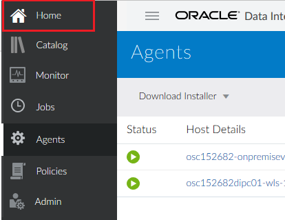
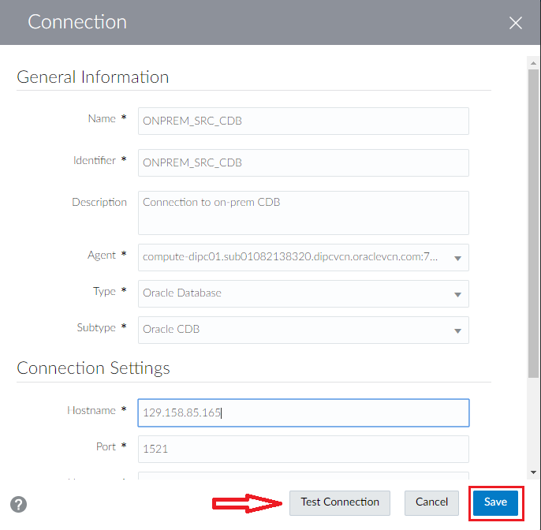

# Lab 300 - Remote Agent Install and On-prem to On-prem DB Synchronization


## Before You Begin

### Introduction
This lab covers installation and configuration of DIPC remote agent along with synchronization of two on-prem database schemas. Remote agents allow synchronization of data outside Oracle Cloud; that is, the source, the target or both might be outside of the Oracle Cloud. 

A VM is used to simulate an On-Prem environment; both source and target schemas reside in the same on-prem database.

### Objectives
-	Download, install and configure DIPC remote agent
-   Migrate an On-Premise database to a second On-Premise database and keep them synchronized
   
### Time to complete
Approximately 30 minutes

### What Do You Need?
Your will need:
- DIPC Instance URL
- DIPC User and Password
- DB information for on-prem source system: server name/ip address, user/password and service name
- DB information for on-prem target system: server name/ip address, user/password and service name
- OnPremiseVM public IP address
- Putty for SSH connection to instances
- Private keys in OpenSSH format for compute instance
- VNC viewer
- SQL developer
- General understanding of RDBMS and data integration concepts


## Remote Agent

### Install Agent
1.	Open an SSH session into your compute server (we will simulate on-prem with a compute instance); please refer to Appendix 1 to learn how to establish an SSH session.
2.	Move to the directory where the remote agent was downloaded, execute:<br/>

<p align="center">
cd /home/oracle/dipcagent/dicloud
</p>

3.	Execute command to install agent: <br/>
./dicloudConfigureAgent.sh -recreate -debug -dipchost=**\<DIPC_SERVER\>** -dipcport=443 -user=**\<YOUR_USER\>** -password=**\<YOUR_PASSWORD\>** -authType=OAUTH2 -idcsServerUrl=https://idcs-bfb16122271a47fc91ada73842325e52.identity.oraclecloud.com -agentIdcsScope=**\<YOUR_DIPC_SECAPP\>** -agentClientId=4b8201b85cb946eab6f0006c37093f26 -agentClientSecret=c5e45679-aa81-4d98-a574-01c0484b37b6
	```
	where:
		<DIPC_SERVER> - This is the name of your DIPC Server. This have been provided in your environment page; look for entry DIPC_SERVER. For example: osc######DIPC##-oscnas001.uscom-central-1.oraclecloud.com
		<YOUR_USER> - This is the login you use to log into Oracle Cloud/DIPC server. This have been provided in your environment page; look for entry YOUR_USER
		<YOUR_PASSWORD> - This is the password of the login you use to log into Oracle Cloud/DIPC server. This have been provided in your environment page; look for entry YOUR_PASSWORD
		<YOUR_DIPC_SECAPP> - This is the scope of the security application defined in the Identity Server. This have been provided in your environment page; look for entry YOUR_DIPC_SECAPP
	```
4.	A new structure will be created, to look at it execute:<br/>

<p align="center">
ls
</p>

5.	We will take a look at the configuration file (agent.properties). Move to the configuration directory, execute:<br/>

<p align="center">
 cd /home/oracle/dipcagent/dicloud/agent/dipcagent001/conf
</p>

6.	Open the file, execute:<br/>

<p align="center">
nano agent.properties 
</p>


7.	Locate parameter "agentPort"

8.	Each agent needs to be in its own DIPC port; if you require to change the port, this is where you come to change it, For example, you would change the port from "7005" to "7010"

9.	And then save your changes, press ctrl-x, "Y", then press the ENTER key


 ### Start the Remote Agent
1.	We will move to the directory with the necessary commands to start the agent; execute:<br/>

<p align="center">
 cd /home/oracle/dipcagent/dicloud/agent/dipcagent001/bin
</p>

2.	We will start the agent by executing:<br/>

<p align="center">
nohup ./startAgentInstance.sh &
</p>

3.	Your agent is now running. If you're not logged in, log into your DIPC server and navigate to the "Agents" screen.
4. You will see the new remote agent.


## Log into DIPC Server

### Login into DIPC using Oracle Cloud Services Dashboard

1. In your web browser, navigate to cloud.oracle.com, then click "Sign in".
2. Provide the cloud account; for example,oscnas001 then **\<Enter\>**.

3. Provide your user name and password, then click "Sign In" button. You will land in your Home screen. 
4. Scroll in your home screen until you locate "Data Integration Platform" service and click on it.  
5. Click on the hamburger menu of the DIPC server assigned to you, then click "Data Integration Platform Console". 

You will be navigated to your DIPC server Home page. 


### Login into DIPC using direct URL

1. Open a browser window an provide your DIPC server URL. The URL will be provided by the instructor and will look like this one "https://osc132657dipc-oscnas001.uscom-central-1.oraclecloud.com/dicloud"
2. Provide your user name and password, then click "Sign In" button. 
You will be navigated to your DIPC server Home page.


## On-Prem to On-Prem synchronization

### Execute Data Synch Elevated Task
1. You should be logged into DIPC, if that is NOT the case, log in.
2. From the left side panel, click on "Home". 

3. For synchronization jobs we will need a CDB (Container DB) connection to our DB. In the Home Page locate and click the “Create" button in the "Connection” box from top section.

4. Enter the following information:
    - Name: ONPREM_SRC_CDB
    - Description:  CDB User for on-prem source DB
	- Agent: **\<REMOTE_AGENT\>**
	- Type: Oracle
  	- Hostname: **\<COMPUTE_IP_ADDRESS\>**
	- Port: 1521
	- Username: C##GGSRC
	- Password: Welcome#123
	- Service Name: onprem
	```
	where:
		<REMOTE_AGENT> - Select the remote DIPC agent you just created
		<COMPUTE_IP_ADDRESS> - IP Address of the compute instance (simulated OnPrem environment). This have been provided in your environment page; look for entry SERVER _IP_ADDRESS
	```
5. Click "Test Connection" button and when the test is successful click "Save" button.

6. Open the "Create" drop-down menu from the top far right corner of the screen and then select “Connection”.

7. Enter the following information:
    - Name: ONPREM_SRC
    - Description: Connection to on-prem database schema with source tables. AMER
	- Agent: **\<REMOTE_AGENT\>**
	- Type: Oracle
  	- Hostname: **\<COMPUTE_IP_ADDRESS\>**
	- Port: 1521
	- Username: AMER_SRC
	- Password: Welcome#123
	- Service Name: PDB1
    - Schema Name: AMER_SRC (Default)
	```
	where:
		<REMOTE_AGENT> - Select the remote DIPC agent you just created
		<COMPUTE_IP_ADDRESS> - IP Address of the compute instance (simulated OnPrem environment). This have been provided in your environment page; look for entry SERVER _IP_ADDRESS
	```
8. Click on "Test Connection" button and when the test is successful click "Save" button.

9. From the top bar, open the drop-down menu and the select "Connection" 

10. Enter the following information:
    - Name: ONPREM_TRG
    - Description: Connection to target schema onprem_trg EMEA
	- Agent: **\<REMOTE_AGENT\>**
	- Type: Oracle
	- Hostname: **\<COMPUTE_IP_ADDRESS\>**
	- Port: 1521
	- Username: EMEA_TRG
	- Password: Welcome#123
	- Service Name: PDB1
    - Schema Name: EMEA_TRG (Default)	
	```
	where:
		<REMOTE_AGENT> - Select the remote DIPC agent you just created
		<COMPUTE_IP_ADDRESS> - IP Address of the compute instance (simulated OnPrem environment). This have been provided in your environment page; look for entry SERVER _IP_ADDRESS
	```	
11. Click on "Test Connection" button and when the test is successful click "Save" button.

12. From the top bar, open the drop-down menu and the select "Synchronize Data" 

13. Enter the following information:
	- Name: Sync OnPrem Schemas
	- Description: Sync on-prem schemas AMER to EMEA
	- Connection: ONPREM_SRC
	- Schema: AMER
	- Connection: ONPREM_TRG
	- Schema: EMEA
	- Advanced - Include Initial Load: SELECTED
	- Advanced - Include Replication: SELECTED
14. Click on "Save & Run" button on the top right of the screen to execute the task

15. A message will appear in the notification bar and you will be navigated to the "Monitor" screen. 
16. The job will automatically appear within the "Monitor" page

17. Click job to review details 


## Verify Data in Source and Target DBs (Optional)
Up until this point, we have monitored the job within DIPC but it would nice to see the data in both source and target to verify that they are the same. For such task, we will use SQL Developer; please refer to Appendix 3 to learn how to create connections against the workshop databases.

1. Start SQL Developer. On the connections panel, select your source database WS - AMER_SRC) and click on the plus (+) sign to open the connection 

 
2.	Once opened, copy and paste the following statements in the panel on the right:
	```
	SELECT COUNT(*)CATEGORIES FROM CATEGORIES;
	SELECT COUNT(*)CUSTOMERS FROM CUSTOMERS;
	SELECT COUNT(*)CUSTOMERS_INFO FROM CUSTOMERS_INFO;
	SELECT COUNT(*)ORDERS FROM ORDERS;
	SELECT COUNT(*)ORDERS_TOTAL FROM ORDERS_TOTAL;
	SELECT COUNT(*)PRODUCTS FROM PRODUCTS;
	SELECT COUNT(*)PRODUCTS_DESCRIPTION FROM PRODUCTS_DESCRIPTION;
	```
3.	Execute the statements by clicking on the “Run script” icon (second icon from left to right on the icon bar; right-ponting green arrow head on top of a page) 

4.	This will show all entities count on the results panel (lower section) 

5.	Repeat steps 1 through 4 for connection “WS - EMEA_TRG” 


This will show that the count in both data bases is exactly the same.


## Summary
You have now successfully completed the Hands-on Lab, and have successfully installed the remote agent and synchronized two on-prem databases.
