# Lab 400 - Migrate On-Prem Database to Cloud


## Before You Begin

### Introduction 
This lab covers synchronization of an on-prem and cloud database using a previously installed remote DIPC agent. Agents allow synchronization of data from sources outside Oracle Cloud. Two VMs will be used to simulate a DIPC instance and an On-Prem database server. The DIPC repository database also host the cloud target schema.


This lab supports the following use cases:
-   Configure Remote DIPC  (Optional already done in Lab 300)
-   Synchronize On-Premise Database

### Objectives
-   Review downloading process, installation and configuration of DIPC remote agent
-   Migrate an on-prem database to a database cloud service

### Time to complete
Approximately 45 minutes.

### What Do You Need?
Your will need:
- DIPC Instance URL
- DIPC User and Password
- DB information for on-prem source system: server name, user/password and service name
- DB information for cloud target system: server name, user/password and service name
- Private keys in OpenSSH format for all instances 
- OnPremiseVM public IP address
- Putty for SSH connection to instances
- VNC viewer
- SQL developer

## Remote Agent
If you have already downloaded the agent to your "On-Prem" environment, please skip this section

### Download Agent
1.	Open an SSH session into your compute server (we will simulate on-prem with a compute instance); please refer to Appendix 1 to learn how to establish a SSH session
2.	Open a VNC viewer; please refer to Appendix 2 to learn how to establish a VNC session
3.	Open a terminal; select “Applications } Favorites } Firefox” from the top left corner of the screen 

4.	Navigate to your DIPC server, provide the URL (it should look like this): https://osc132657dipc-oscnas001.uscom-central-1.oraclecloud.com/dicloud
5.	Provide your user name and password, then click "Sign In" button 
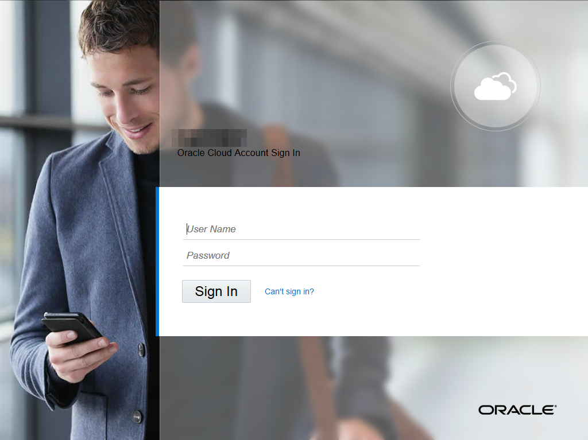
6.	This will bring you to your DIPC server’s  home page
7.	Click on “Agents” (left part of your screen) 
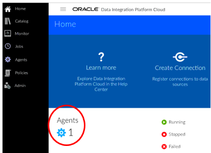
8.	Click on "Download Installer" button 
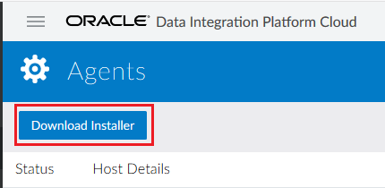
9. Open the drop down menu and select the Operating System of your choice; in our case “Linux” 

10.	Once you have selected the operating system, you can choose the components that you would need in your remote agent. Select "Oracle 12c" then click on "Download" button. 

11.	Select “Save File” and the click “OK”, to download the file to your “on-premise” machine 
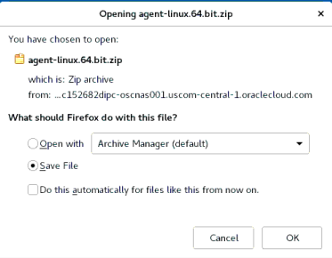


### Download DIPC Certificate
1. If you are NOT already logged into your DIPC server, log into it. 
2. Once in your DIPC server, click on the green padlock icon on the left of the address field of your browser 

3.	Click on the arrow on the right side of the listed secure connection 
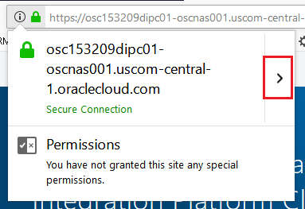
4.	Click on “More Information” hyperlink of the Site Security pop-up 
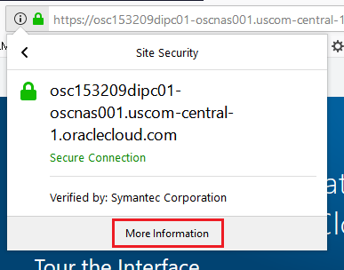
5.	In the “Website Identity” section of the “Security” tab click “View Certificate” button 
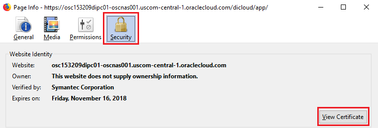
6.	In the “certificate Viewer” applet in the “Details” tab, click “Export …” button 

7.	On the left panel click on "oracle", then click button "Create Folder", provide name "Certificate" 
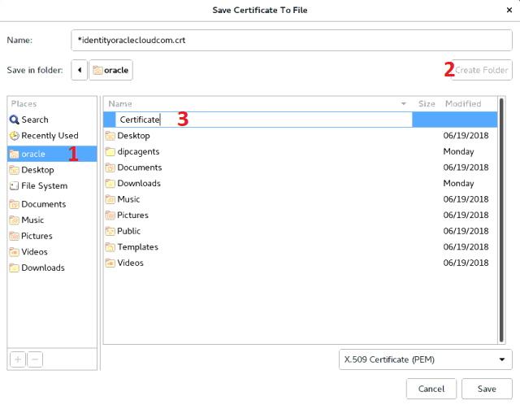
8. Now you are in the directory you just created, be sure to get rid of the character ("*" or “-“) located at the beginning of the default name. Click “Save’ button 
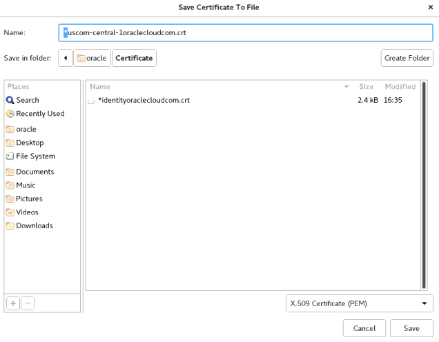
9.	Close all applets


### Add Certificate to Keystore
1.	In your on-prem machine, open a terminal, select “Applications } Favorites } Terminal” from the top left corner of the screen 
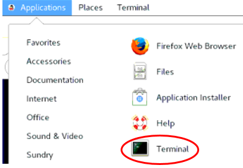
2.	Import the client side certificate into the cacerts in your system. Execute:
$JAVA_HOME/bin/keytool -import -alias uscom-central-1oraclecloudcom  -keystore $JAVA_HOME/jre/lib/security/cacerts -file /home/oracle/Certificate/uscom-central-1oraclecloudcom.crt
3.	Provide password: “changeit”
4.	Answer “yes” to question “trust this certificate?”


### Install Agent
1.	In the terminal you opened in your on-prem machine, create a directory for the agent's files, execute: mkdir dipcagent
3.	Move the downloaded file to that new directory, execute: mv Downloads/* dipcagent
4.	Move to the new directory, execute: cd dipcagent
5.	Unzip the file, execute: unzip agent-linux.64.bit.zip
6.	Move to the agent directory, execute: cd dicloud
7.	Execute command to install agent: 
./dicloudConfigureAgent.sh -recreate -debug -dipchost=**{DIPC SERVER}** -dipcport=443 -user=**{YOUR_USER}** -password=**{YOUR_PASSWORD}** -authType=OAUTH2 -idcsServerUrl=https://idcs-bfb16122271a47fc91ada73842325e52.identity.oraclecloud.com -agentIdcsScope=https://919181A11AC6494CBCFA146EBC9A2A48.uscom-central-1.oraclecloud.com:443external -agentClientId=ec9958f548e7414f872cc480c0bf3455 -agentClientSecret=77321de1-6f4a-4997-945e-8acb271b0473
	```
	where:
		{DIPC SERVER} - This have been provided in your environment page. Look for entry DIPC SERVER.
		{YOUR_USER} - This is the login you use to log into Oracle Cloud/DIPC server
		{YOUR_PASSWORD} - This is the password of the login you use to log into Oracle Cloud/DIPC server
	```
8.	New directories will be created, to look at then execute: ls
9.	We will take a look at the configuration file (agent.properties) and we will change the port in which this agent will talk to DIPC
10.	Open the editor, select “Applications > Accessories > Editor” from the top left corner of the screen 
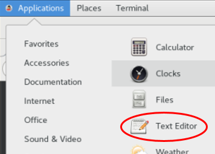
11.	Click on “Open” then “Other Documents” 

12.	Browse to “/home/oracle/dipcagent/dicloud/agent/dipcagent001/conf/agent.properties” 

13.	Modify agent port "agentPort" in parameter file "agent.properties" to 7010 

14.	Save and close. Click on “Save” button then on "Close" icon (top right corner)


### Start the Agent
1.	We will move to the directory with the necessary commands to start the agent; execute: cd agent/dipcagent001/bin
2.	We will start the agent by executing:
nohup ./startAgentInstance.sh &
3.	Your agent is now running. Go back to Firefox and look the “Agent” screen in DIPC 


## Migrate On-Prem to the Cloud

### Verify Data in Source and Target DBs (Optional)
** MISSING STEPS
** Saves images 15 to 29 for this section
** Images for source could be the same as in Lab300, images for target need to be new


### Execute Data Synch Elevated Task
1. You should be logged into DIPC, if that is NOT the case, log in.
2. From the left side panel, SELECT "Home" 

3. If you have already created connection "ONPREM_SRC", skip to step 7. If connection "ONPREM_SRC" has NOT yet been created, in the Home Page click "Create Connections" from the top section 

4. Enter the following information:
    - Name: ONPREM_SRC_RAGENT
    - Description: Connection to on-prem database schema with source tables. AMER
	- Agent: **{REMOTE_AGENT}**
	- Type: Oracle
  	- Hostname: **{COMPUTE_INSTANCE_IP}**
	- Port: 1521
	- Username: AMER_SRC
	- Password: Welcome#123
	- Service Name: PDB1
    ```
    where:
        {REMOTE_AGENT} - Select the remote (on-prem) DIPC agent 
        {COMPUTE_INSTANCE_IP} - IP Address of the compute instance we are using to simulate on-premise environment        
    ```
5. Click "Test Connection" button and when the test is successful click "Save" button.

6. In the catalog screen, open the drop-down menu from the top far right corner and then select “Connection”

7. Enter the following information:
    - Name: EMEA_CLOUD_RAGENT
    - Description: Connection to target schema cloud target EMEA
	- Agent: **{REMOTE_AGENT}**
	- Type: Oracle
	- Hostname: **{TARGET_DB_NAME}**
	- Port: 1521
	- Username: EMEA_CL_TRG
	- Password: Welcome#123
	- Service Name: **{TARGET_DB_SERVICE_NAME}**
    - Schema Name: EMEA_CL_TRG (Default)
```
where:
    {REMOTE_AGENT} - Select the remote (on-prem) DIPC agent 
    {TARGET_DB_NAME} - Name of the target database server
    {TARGET_DB_SERVICE_NAME} - Service name string for the target database server
```
8. Click "Test Connection" button and when the test is successful click "Save" button

9. From the top bar, on the right corner, open the drop-down menu and the select "Synchronize Data"

10. Enter the following information:
	- Name: Sync OnPrem to Cloud
	- Description: Sync on-prem to cloud schemas AMER to EMEA
	- Connection: ONPREM_SRC_RAGENT
	- Schema: AMER_SRC
	- Connection: EMEA_CLOUD_RAGENT
	- Schema: EMEA_CL_TRG
	- Advanced - Include Initial Load: SELECTED
	- Advanced - Include Replication: SELECTED
9. Click on "Save & Run" button on the top right of the screen to execute the task

10. You will be navigated to the "Monitor" screen. After some time, a message will appear in the notification bar
11. The job will automatically appear in the "Jobs" list
12. Click job to review details

13. Details on the jobwill be provided


### Verify Data in Target DB (Optional)
Up until this point, we have monitored the job within DIPC but it would nice to see the data in both source and target to verify that they are the same. For such task, we will use SQL Developer; please refer to Appendix 3 to learn how to create connections against the workshop databases.
1.	Start SQL Developer. On the connections panel, select your source database (WS - AMER_SRC) and click on the plus (+) sign to open the connection 

2.	Once opened, copy and paste the following statements in the panel on the right:
```
SELECT COUNT(*)CATEGORIES FROM CATEGORIES;
SELECT COUNT(*)CUSTOMERS FROM CUSTOMERS;
SELECT COUNT(*)CUSTOMERS_INFO FROM CUSTOMERS_INFO;
SELECT COUNT(*)ORDERS FROM ORDERS;
SELECT COUNT(*)ORDERS_TOTAL FROM ORDERS_TOTAL;
SELECT COUNT(*)PRODUCTS FROM PRODUCTS;
SELECT COUNT(*)PRODUCTS_DESCRIPTION FROM PRODUCTS_DESCRIPTION;
```
3.	Execute the statements by clicking on the “Run script” icon (second icon from left to right on the icon bar; right-ponting green arrow head on top of a page)

4.	This will show all entities count on the results panel (lower section) 

5.	Repeat steps 1 through 4 for connection “WS - EMEA_CL_TRG”     

This will show that the count in both data bases is exactly the same.


## Summary
You have now successfully completed the Hands-on Lab, and have successfully installed the remote agent and migrated a database from on-prem to cloud.