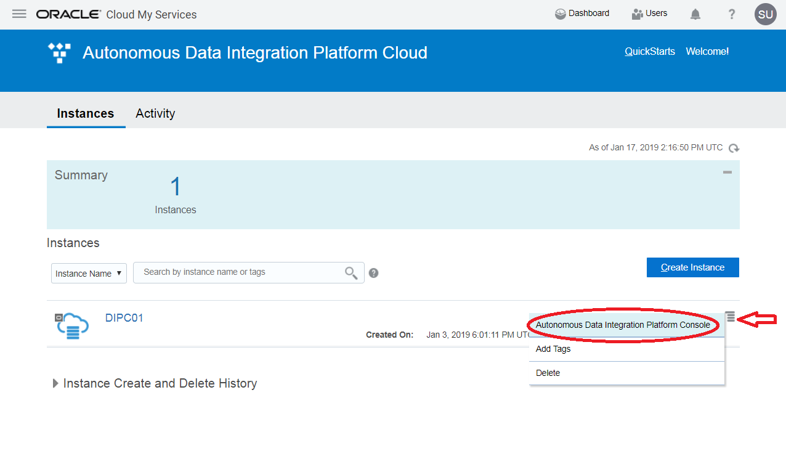
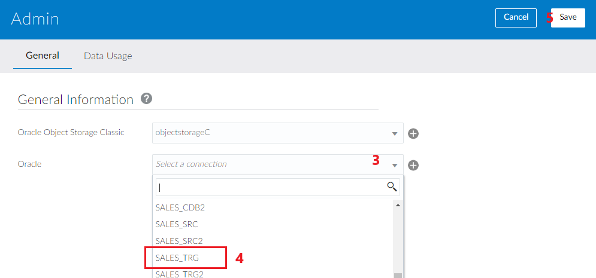
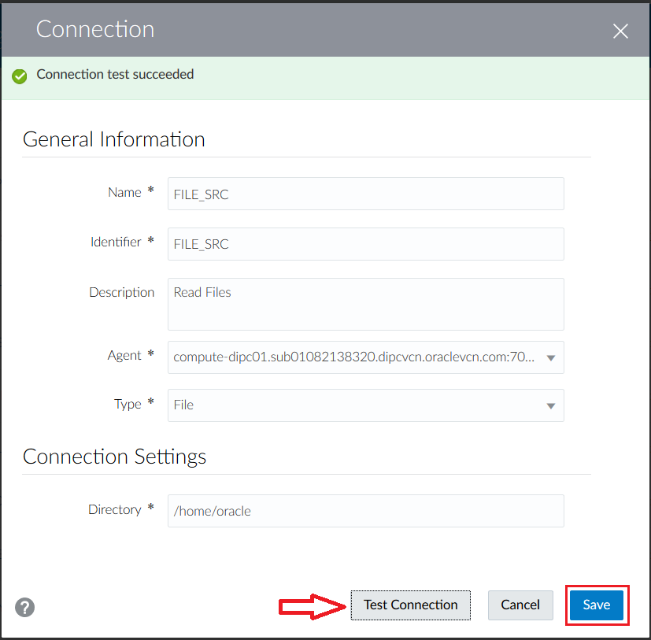
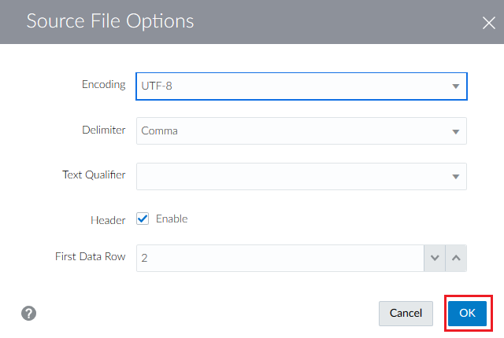
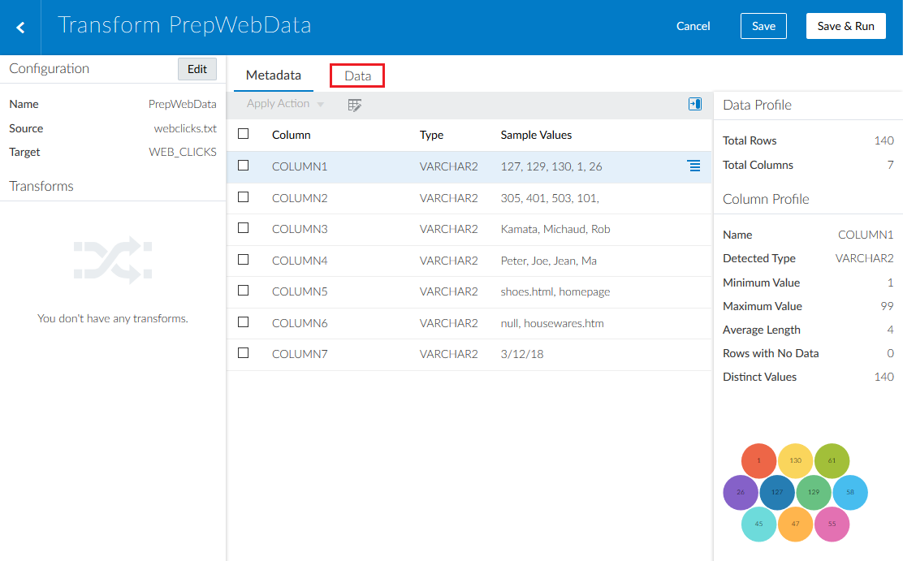
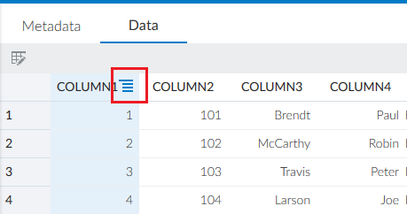
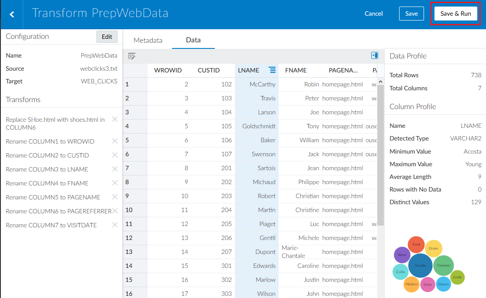
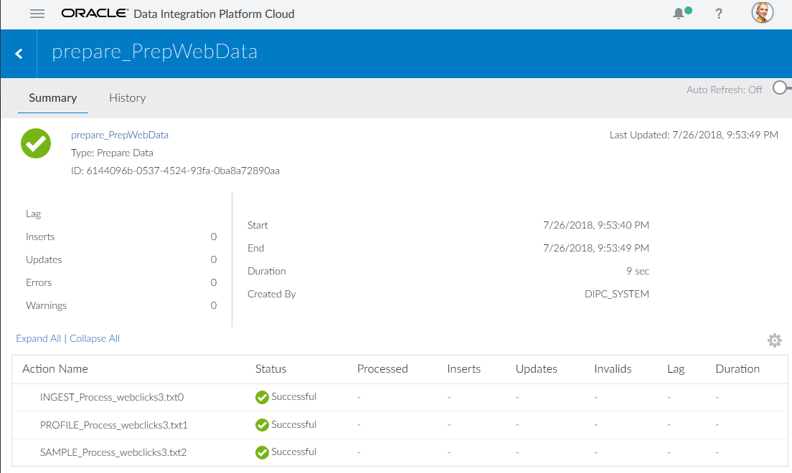

# Lab 500 - Data Preparation


## Before You Begin

### Introduction
Data Preparation task enables you to harvest data from a source File or Oracle database, and then cleanse, organize, and consolidate that data. This lab will show you how to use this elevated task. 

### Objectives
- Prepare data from flat files
- Transform data elements
- Administer transformations

### Time to Complete 
Approximately 15 minutes

### What Do You Need?
Your will need:
- DIPC Instance URL
- DIPC User and Password
- Flat file "webclicks.txt"
- DB information for target system: server name, user/password and service name
- SQL Developer


## Log into DIPC Server

### Login into DIPC using Oracle Cloud Services Dashboard

1. In your web browser, navigate to cloud.oracle.com, then click "Sign in".
2. Provide the cloud account; for example,oscnas001 then **\<Enter\>**.

3. Provide your user name and password, then click "Sign In" button. You will land in your Home screen. 
4. Scroll in your home screen until you locate "Data Integration Platform" service and click on it.  
5. Click on the hamburger menu of the DIPC server assigned to you, then click "Data Integration Platform Console". 

You will be navigated to your DIPC server Home page. 


### Login into DIPC using direct URL

1. Open a browser window an provide your DIPC server URL. The URL will be provided by the instructor and will look like this one "https://osc132657dipc-oscnas001.uscom-central-1.oraclecloud.com/dicloud"
2. Provide your user name and password, then click "Sign In" button. 
You will be navigated to your DIPC server Home page.


## Execute Data Preparation Elevated Task

### Data Prep Task
1. You should be logged into DIPC, if that is NOT the case, log in.
2. In the Home Page scroll down until you see the "Getting Started" section
3. Once you have located the "Data Preparation" task icon, click on the “Create" button 


### Staging Connection Definition (Optional)
If you receive the following error message:


this means your system has NO defined staging area  to upload the data temporarily to prep it. 

In order to define the staging area:

1. Click on "Select a default staging connection" hyperlink. You will navigate to the Admin screen in which you can define this default connection.
2. Click on the "Edit" button located in the top right corner of the screen.

3. Open the dropdown menu for the "Oracle" field.
4. Select one of the connections. For the purpose of this workshop we will select "SALES_TRG".

5. Save your changes by clicking on the "save" button located on the top-rightcorner of your screen.
6. Go back to the task creation. Go to your home page by clicking in the Home hyperlink located on the top-left corner of your screen.

7. In the Home Page scroll down until you see the "Getting Started" section
3. Once you have located the "Data Preparation" task icon, click on the “Create" button 


### Execute Data Preparation Task

1.	Provide the following information:
	- Name: PrepWebData 
	- Description:  Prep External Website Data
2. For "Source Configuration" click on "Create Connection" button.

3. Provide the following information:
	- Name: FILE_SRC
	- Description: Read Files
	- Agent: **\<REMOTE_AGENT\>**
	- Type: File
	- Directory: /home/oracle
   ```
    where:
        <REMOTE_AGENT> - Select the DIPC agent you created
 	```
4. Click "Test Connection" button and when the test is successful click "Save" button.

5. You will go back to the "Data Prep" task creation screen; the directory field will be already filled in with the information you provided in the connection. Now provide the name of the file:
	- Click on "Select" button located at the right end of the field
	- Click on "webclicks.txt" hyperlink and then the "Select" button 
	
6.	Let's review the file option DIPC offers, Click on "Options" button located at the far right end of the field "File".
7. Provide the following information:
	- Edcoding: UTF-8
	- Delimiter: Comma
	- Text Qualifier: Leave blank
	- Header: SELECTED 
	- First Data Row: 2
8. Click on "OK" button.

9. For "Target Configuration" click on the dropdown menu button located at the right end of the "Connection" field.
10. Select/Provide the following:
	- Connection: SALES_TRG
	- Schema: SALES_TRG 
	- Data Entity: WEB_CLICKS 
11. Execute the task, click on "Save and Transform" button .

12.	As the file is being parsed and profiled, the following screen will appear . 

13. Once finished, the data preparation screen will come up. The profiling process has captured advanced profiling information as the flat file was ingested.  Click each column to review the profiling results in the right hand data profile drawer.
14. There is a second tab in which is possible to review the data in the file; click the "Data" tab.

15. To transform data on a particular column, click the hamburger menu on the column you want to transfom. 

16. For Column 6, click on the hamburger menu and then select "Replace".  

17. Provide the following information:
	- Search String: SHoe.html
	- Replace String: shoes.html
18. Click the "Apply" button.

This will update data, metadata and profiling statistics.  Also note the transform is saved and displayed in the left-hand drawer.  This transform can be deleted and the data, metadata and profiling statistics will be updated accordingly. 

19. Now please perform the following transformations:
	- Column 1: Rename to WROWID 
	- Column 2: Rename to CUSTID 
	- Column 3: Rename to LNAME 
	- Column 4: Rename to FNAME 
	- Column 5: Rename to PAGENAME 
	- Column 6: Rename to PAGEREFERRER 
	- Column 7: Rename to VISITDATE 
20. Review your transformations.
21. Click "Save and Run" button (top right corner).

22.	You will be navigated to the “Jobs” screen. After some time, a message will appear in the notification bar.
23.	The job will automatically appear within the "Monitor" page. This may take up to 1 minute.

24. Review the job execution, click on the job name.



## Verify Uploaded Data (Optional)

1.	Go to your SQL Developer and expand "WS - SALES_TRG" connection and its tables. If it is already opened, just refresh the information)
2.	Select “WEB_CLICKS” table
3.	On the right panel, select “Data” tab 

 

## Summary 
 You have now successfully completed the Hands on Lab, and have successfully performed a Data Preparation task through Oracle’s Data Integration Platform Cloud. 
