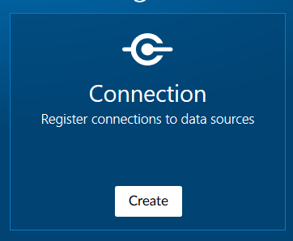
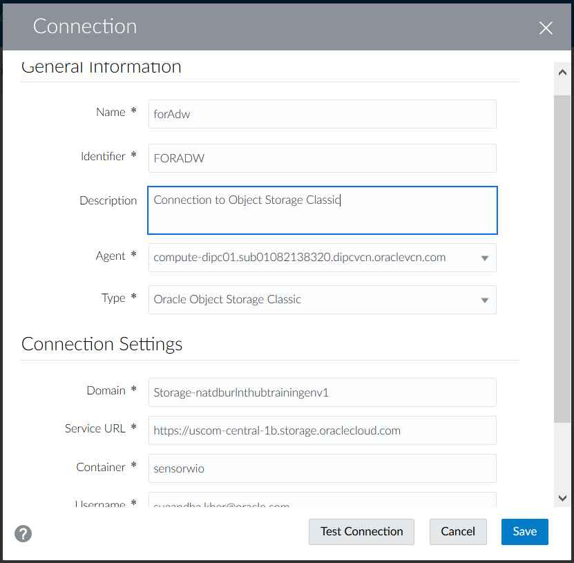
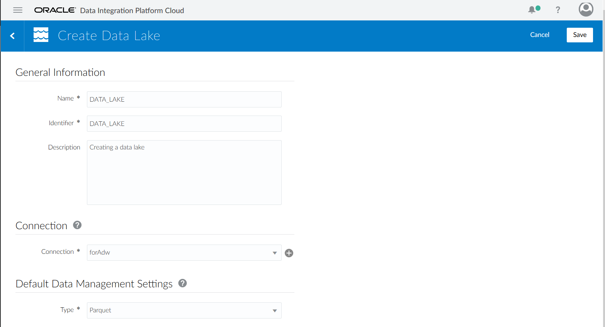
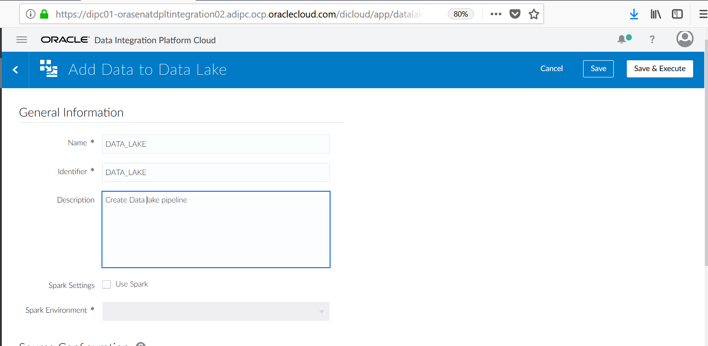
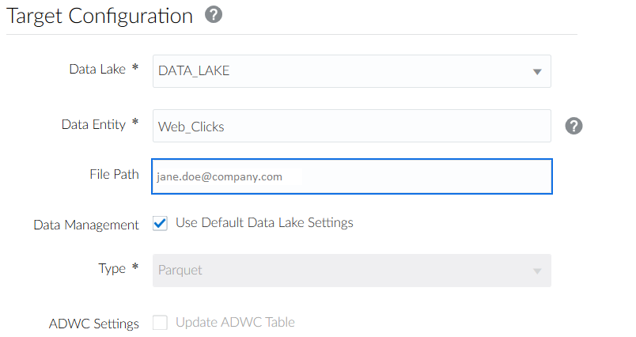
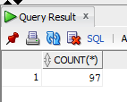

# Lab 600 - Data Lake Builder Elevated Task 
*** NEED TO CREATE THIS CHAPTER ***

## Before You Begin

### Objectives
-   Review how to create connections to Oracle Object Storage
-   Review how to execute a Data Lake Builder task

### Time to Complete 
Approximately 15 minutes.

### What Do You Need?
Your will need:
- DIPC Instance URL
- DIPC User and Password
- Connection information for an Oracle Object Storage container: domain, URL, user/password and container name
- Flat file "webclicks.txt"

### Navigate to Oracle Object Storage sontainer
Before we execute the task, we will navigate to the Object Storage container and gather the necessary information to connect within DIPC, as well as to verify that the container is empty. First of all we will log into you Oracle cloud instance:
1. In your web browser, navigate to cloud.oracle.com, then click Sign in.
2. Provide the cloud account: oscnas001 then <Enter>
3. Provide your user name and password, then click Sign In.

4. Locate Storage Classic service in your dashboard and click in the hamburger menu; then click on "Open Service Console" option

5. In the Storage Classic screen scroll down until you find container "DIPC Workshop", click on it

6. You will see that the container is empty and there is no files on it. We will now gather the necessary information to connect from DIPC, Click on the "Account" tab on top

7. Copy the content of field "Rest Endpoint". It should look like this: https://uscom-east-1.storage.oraclecloud.com/v1/Storage-oscnas100 

8. Store it in a notepad or other text editor, you will need this URL later/

## Create Connection to File (Source)
1. Log into your Workshop DIPC Server
2.	In the Home Page click “Create" button on the "Connection” box from top section

3. 	Enter the following information:
	- Name: FILE_SRC
	- Description: Read Files
	- Agent: <LOCAL_AGENT>
	- Type: File
	- Directory: /home/DIPC
 4. Click "Test Connection" button and when the test is successful click "Save" button

## Create Connection to Object Storage (Target)
1. From the "Create" drop down menu on the top right corner select "Connection"

2.	Enter the following information:
    - Name: DATA_LAKE
    - Description: Connection to Object Storage to create a Data Lake
    - Agent: <LOCAL_AGENT>
    - Type: Oracle Object Storage Classic.
    - Domain: Storage-oscnas001. **From the Rest EndPoint URL you saved previously copy and paste the last part. That is from "https://uscom-east-1.storage.oraclecloud.com/v1/Storage-oscnas100" copy "Storage-oscnas001"**
	- Service URL: https://oscnas001.us.storage.oraclecloud.com. **From the Rest EndPoint URL you saved previously copy and paste the server URL. That is from "https://uscom-east-1.storage.oraclecloud.com/v1/Storage-oscnas100" copy "https://uscom-east-1.storage.oraclecloud.com"**
	- Container: DIPC_Workshop
    - Username: <YOUR_USERNAME>. **For example: osc.dipcws01**
    - Password: <YOUR_PASSWORD>

3. Click "Test Connection" button and when the test is successful click "Save" button. 

### Data Lake Builder task
1.	From the "Create" drop down menu on the top right corner select "Datalake Builder"

2.	Provide the following information:
	- Name:  DATA_LAKE
	- Description: Create Datalake pipeline
	- Connection: FILE_SRC
	- Directory: /home/DIPC/Files. 
		- Click on the "Select" button on the right of the field
		

		- Cl;ick on "Files" directory and then click on "Select" button
		
	- File: webclicks.txt
		- Click on the "Select" button on the right of the field
		

		- Click on  "webclicks.txt" file and then click on "Select" button
		
	- Connection: DATA_LAKE
	- Data Entity: Web_Clicks
	- Type: Parquet
	- File Path: leave it blank
3. Click on "Save & Execute" button located on the top right corner of the screen to execute the task

4.	A meesage  will appear in the notification bar to inform that the test has been created and you will be navigated to the “Monitor” screen. 

5.	The job will appear in the "Monitor" page. This may take up to 1 minute

*** HERE ***
### Review Job in DIPC
1.	You should be in the “Jobs” screen. Click on the job to see details. The "ODI Execution" action will show "Successful" after a little while

2.	Once done, the “ODI Execution” action can be expanded to review the various steps underneath

3.	Click on “Insert new rows:IKM Oracle Incremental Update” to review the code generated by DIPC for the task. 
4.	Click "Done" when you’ve completed the code review

### Verify Sales table in the DWH after execution (Optional)
1.	Go to SQL Developer. On the connections panel, select your DWH (WS - TRG_AGG_SALES) and click on the plus (+) sign to open the connection

	
 
2.	Once opened, copy and paste the following statements in the panel on the right:
SELECT COUNT(*) FROM TRG_SALES;

	

3.	Execute the statements by clicking on the “Run script” ( ) icon (second from left to right on the icon bar
4.	This will show the count on the results panel (lower section)
	
 

## Summary
In this lab, we have seen how it is possible to import ODI flows into DIPC and execute them; making possible for DIPC and standalone ODI to work hand in hand to implement an end-to-end data flow.
