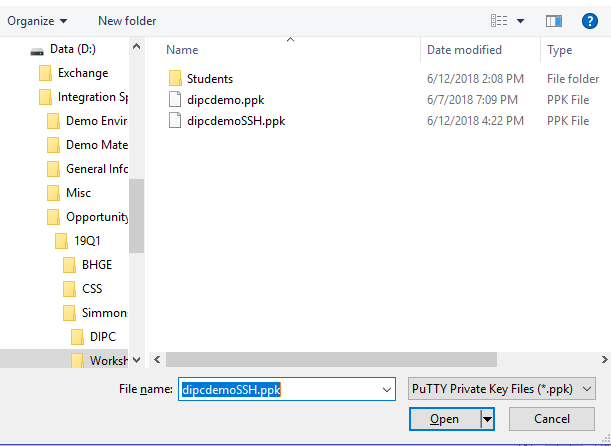
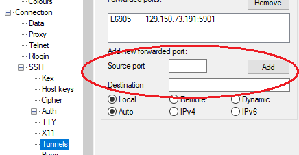
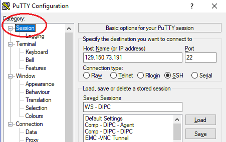
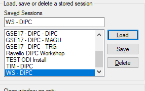

# Appendix 1: SSH Session Configuration

## Create SSH Configuration

1.	Start PuTTY

 

2.	In the screen provide the following information:
    -  Host: **<SERVER_IP_ADDRESS>**
    - Saved Session: Provide a name 

 
3.	Click on “Save” button
4.	From the hierarchical panel on the left, select “Connection > Data” and provide the following information:
    - Auto-login username: opc

5.	From the hierarchical panel on the left, select “Connection > SSH > Auth”. Click on “Browse”  button to select the private key file

 

6.	Navigate to the directory in which you copied the files provided for the labs and select “dipcdemoSSH.ppk”. Click on “Open” button

 

7.	From the hierarchical panel on the left, select “Connection > SSH > Tunnels” and provide the following information:
    - Source port: 6905
    - Destination: **<SERVER_IP_ADDRESS>**:5901
8.	Click on “Add” button

 

9.	From the hierarchical panel on the left, select “Sessions” (on top) and then click on “Save” button. This will save this configuration so you can re-use it.

 

10.	Click on “Open” button to start your SSH session. If you are asked for a passphrase, provide “dipc”

 

## Load Existing Configuration
If you have saved the SSH configuration previously.

1.	Start PuTTY

2.	Select your configuration in the “Saved Sessions” section then click on “Load” button

 

3.	Click on “Open” button to start your SSH session. If you are asked for a passphrase, provide “dipc”
 
 
