Lab 100 -  Creating a Data Integration Platform Cloud Instance

## Before You Begin

Purpose
This tutorial shows you how to create and start a service for Data Integration Cloud Service.

Time to Complete
Approximately 30 minutes, not including wait time for service activations.

Background
Oracle Data Integration Platform Cloud is a platform that unifies various Data Integration components and leverages their core strengths and functionality to offer a seamless set of data integration services in the cloud.

When using the Oracle Data Integration Platform Cloud, you create a Data Integration environment in the cloud. After you complete the instance creation wizard, your environment is provisioned and fully integrated for replication, extract, load and transform, streaming, data preparation, and data governance.

For Data Integration Platform Cloud, you can select one of the following editions:

- Standard Edition: For a bulk copy of your data sources to the cloud, or to extract, load and transform your data.
- Enterprise Edition: For a selective copy or real time replication of your data sources, or to extract, load and transform your data.
- Governance Edition: To extract, load, transform, manage, replicate, and Data Quality.

What Do You Need?

Your Oracle Cloud user name, password, and identity domain, which you should have received FROM Oracle

An Oracle Cloud subscription with the following services:
-     1. Data Integration Platform Cloud Service
-     2. Database Cloud Service
-     3. Compute Classic Cloud Service
-     4. Storage Cloud Service
-   Cloud Dashboard URL
-   Cloud Dashboard login credentials:
-     1. identity domain / account
-     2. username
-     3. password

-   Private keys in OpenSSH format for all instances 
-   OnPremiseVM public IP address
-   VNC Client
-	Putty for ssh connection to instances

What is the baseline architecture?
The above cloud services will be used to create:
-   1 DIPC Instance - DIPCINST
-   2 DBCS Instances - DBCSAMER, DBCSEMEA
-   1 Compute Instance - OnPremiseVM

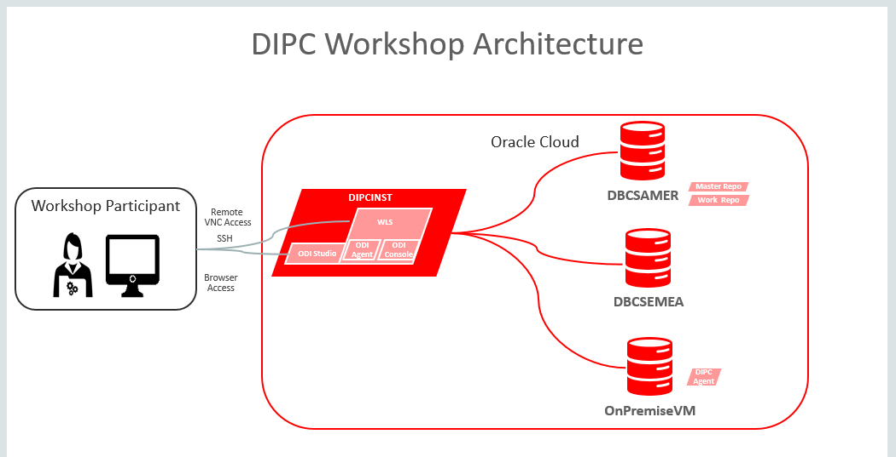

## Logging Into Oracle Cloud Instance

1. In your web browser, navigate to cloud.oracle.com, then click Sign in.
2. Enter your user name and password, then click Sign In.

Click Services or Go to Console to access My Oracle Services.

## Creating an Oracle Database Cloud Instance

1. Locate Database in your list of services, then select Open Service Console from the Action menu.

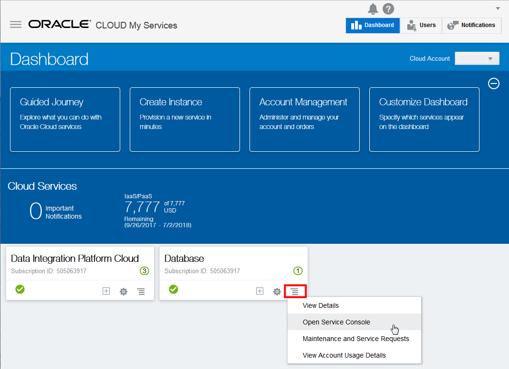

2. On the Services page, click Create Service. This launches the Create DBC instance wizard.

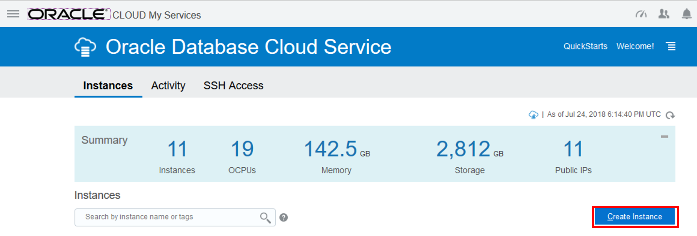

3. Complete the Service form as follows and then click Next:

- Service Name: DBCSABC

- Description: ABC Replication Database for Data Integration Platform Cloud

- Notification Email: (a valid email address to receive provisioning status)

- Region: No Preference

- Software Release: Oracle Database 12c Release 1

- Software Edition: Enterprise Edition

- Database Type: Single Instance

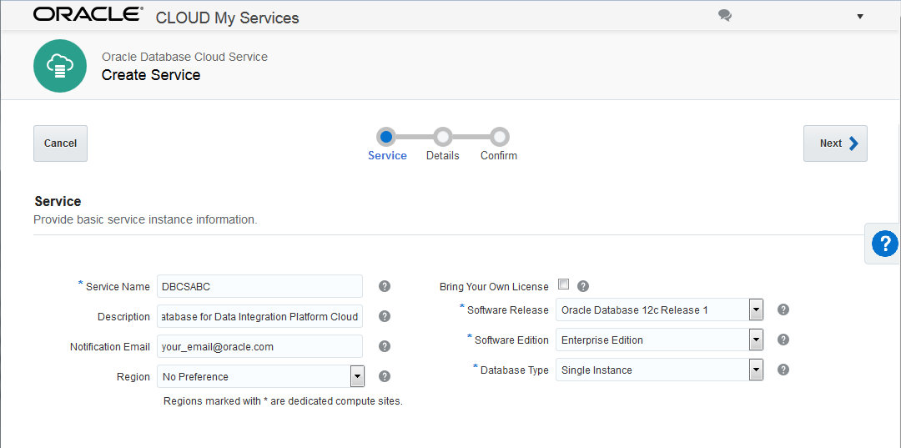

4. On the Service Details page, complete the Database Configuration fields as follows:

- DB Name (SID): ORCL
- Pluggable Database (PDB) name: PDB1
- Administration Password and Confirm Password fields: Welcome_123#.
- Usable Database Storage: 25
- Based on your entry for Usable Database Storage, the Total Data File Storage (GB) field updates to reflect the amount of storage that will be allocated to your instance, including space for operating system and product binaries, supporting files, database data and configuration files, and so on. After you create the service instance, you can add more data storage as needed.

- Compute Shape: OC3
- Click Edit for SSH Public Key.
- In the SSH Public Key for VM Access dialog, select Create a New Key, then click Enter.

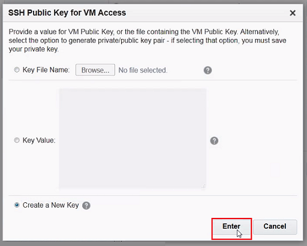

Click Download in the Download Keys dialog box.

Save the sshkeybundle.zip file to your computer.

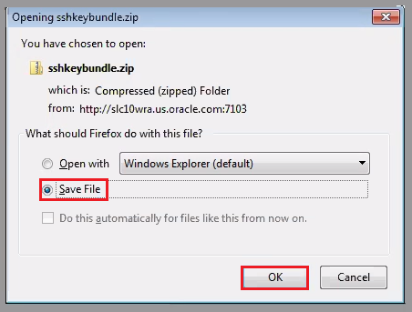

Confirm that the SSH Public Key field now contains a public key value.

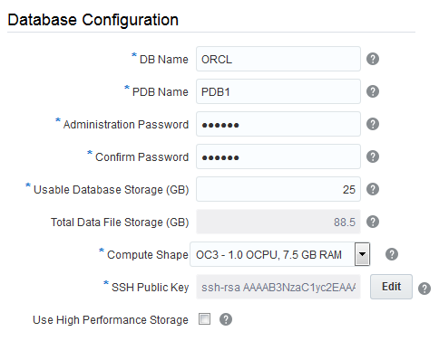

5. Expand Advanced Settings, and then complete the fields as follows:
- Listener Port: 1521
- Select your timezone from the Timezone menu.
- Select Enable Oracle GoldenGate.
- Deselect Include "Demos" PDB to save database space.

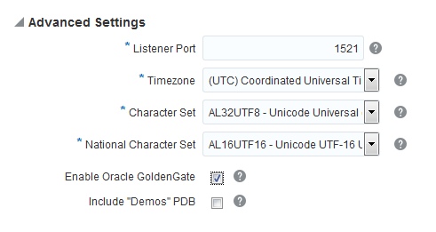

6. Complete the Backup and Recovery Configuration fields as follows, and then click Next:

- Backup Destination: Both Cloud Storage and Local Storage
- Cloud Storage Container: Enter the name of your storage container in the format, Storage-<identity domain name>/<container name>. For example, enter Storage-dipc/dipcABC.
- Username: Enter your username for Oracle Storage Cloud
- Password: Enter your password for Oracle Storage Cloud
- Select Create Cloud Storage Container to create a new container.

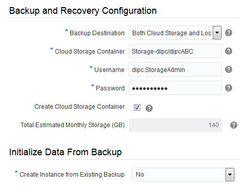

7. Review the Service Details for your DBCS instance. If you need to make changes, click Previous or use the navigation train to go back. Otherwise, click CANCEL NOT Create! The instance creation process can take some time, you'll see, so we have alreadey created the instance in advance. Proceeed to the next section.

## Creating an Oracle Data Integration Platform Cloud Instance

In this section, you create an Oracle Data Integration Platform Cloud instance using the instance creation wizard.

1. Locate Data Integration Platform Cloud in your list of services, then select Open Service Console from the Options menu.

2. In the Services page, click Create Service.

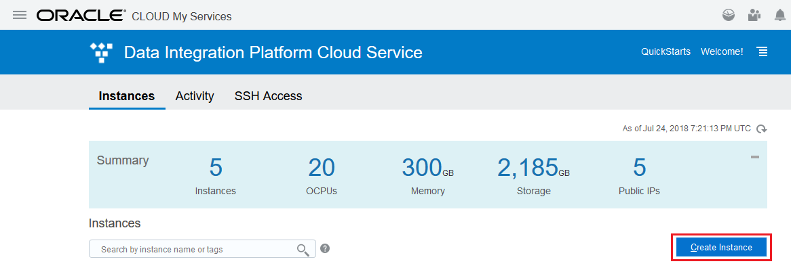

3. Complete the Service fields as follows, and hen click Next:
- Service Name: DIPCABC
- Description: Data Integration Platform Cloud for ABC instance
- Email Address: (a valid email address to receive provisioning status)
- Cluster Size: 2
- Service Edition: Governance Edition

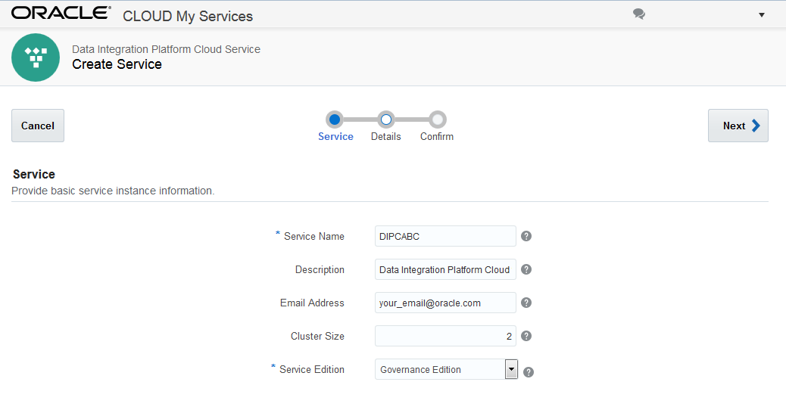

4. Complete the Database Configuration fields as follows:

- Oracle Database Cloud Service Instance Name: DBCSABC
- PDB Name: PDB1
- Administration Username: SYS
- Password: Welcome_123#

5. Complete the Backup and Recovery Configuration fields as follows:

- Cloud Storage Container: Storage-dipc/dipcABC
- Cloud Storage User Name: Enter your username for Oracle Storage Cloud
- Cloud Storage Password: Enter your password for Oracle Storage Cloud

6. Complete the Weblogic fields as follows:

- Compute Shape: OC3m - 4.0 OCPU, 60.0GB RAM
- SSH Public Key:
a. Click Edit.
b. In the SSH Public Key for VM Access dialog, select Create a New Key and then click Enter.
c. In the Download Keys dialog, click Download and save your SSHkeybundle.zip to your local machine.

- Administrator Username: weblogic

- Admin Password: Enter the admin password that you'll use later to login to all the consoles for this service instance, with the correspondent username you have had specified. For example welcome1

- Confirm Admin Password: Reenter the admin password

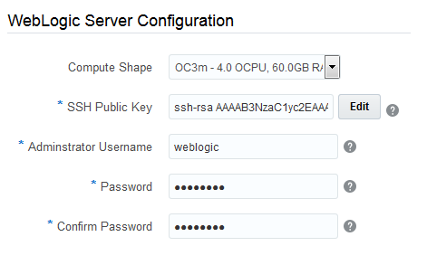

7. Click Next and review your Data Integration Platform Cloud instance configuration details. If you need to make any changes, click Previous use the navigation train to go back. Otherwise, click CANCEL - we have already created the instance for you in advance.

The instance creation process would normally take up to 30 minutes, so we have already created the instance in advance of the workshop.

