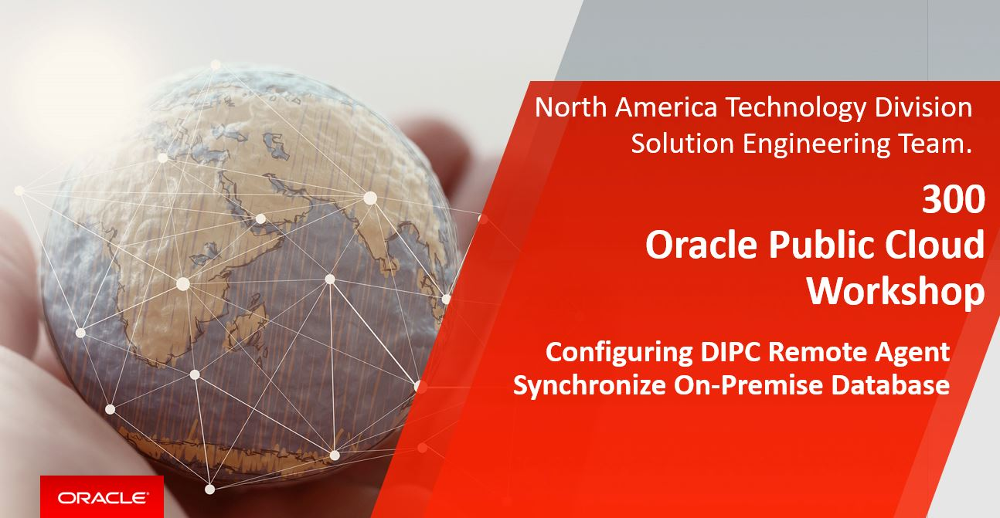
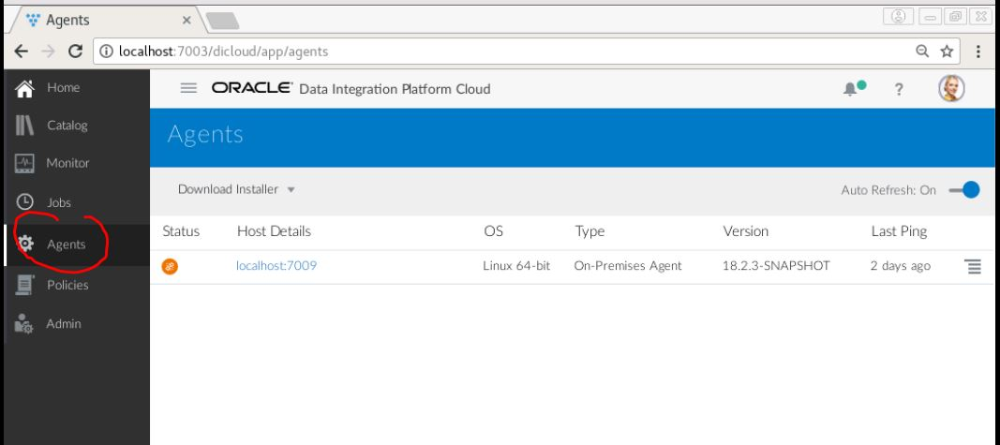
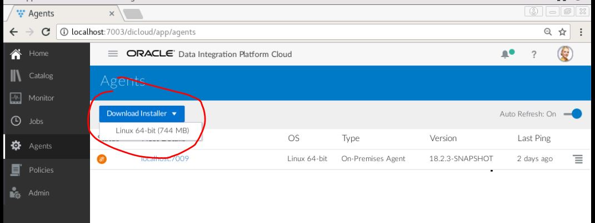
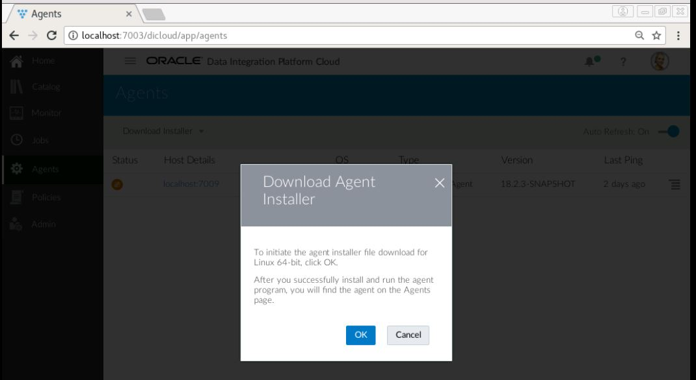

Update: Apr 25, 2018

## Introduction - Remote Agent Install and Synchronization of an On-prem database

This lab covers installation and configuration of DIPC remote agent along with synchronization of an on-prem database. Agents allow synchronization of data from sources outside Oracle Cloud. Two VMs within Ravello will be used to simulate a DIPC instance and an On-Prem database server.

This lab supports the following use cases:
-   Configure Remote DIPC Agent
-   Synchronize On-Premise Database

## Objectives

-   Ensure Ravello VMs for DIPC and DB 
-	Ensuring Remote Agent is trusted by DIPC instance
-   Agent Download
-   Agent Installation and Configuration
-   Configure Agent SSL
-	Agent Administration - Starting and Stopping.
-   Synchronize On-Premise Database
   
### **STEP 1**: Log into DIPC Console and go to Agent Page

-   Click "Agents" in left panel

	

### **STEP 2**: Select Download Installer Drop Down Menu

-   Select drop down menu and select zip file for your Operating System

	

### **STEP 3**: Confirm your agent download selection

-   Click "OK" to confirm selection

	

### **STEP 4**: Save the agent zip file to your home directory

-   Save the file to your home directory in preparation to unzip and install

	

### **STEP 4**: Save the agent zip file to your home directory

-   Save the file to your home directory in preparation to unzip and install

	

    
## Required Artifacts

-   The following lab does not require set up or artifacts from the previous labs.

## Create an instance

In lab 100 we created an instance from a cloud backup of an on-premise instance.  To create an instance from scratch the process is very similar.  We will not actually create the instance, but will walk through the screens but cancel before the final step.

### **STEP 1**: Log into the Oracle Cloud Console and select the database service (same a lab 100)

-   Open Firefox on the compute image desktop and log into the Oracle Cloud

	

	

-   You should end up on the Database service.  If not select the Dashboard link (upper right) and then Database (see below). 

	

-   You may also land here if not on the database service (depending on what screens you had been in previously).  Then select database.

	

    

### **STEP 2**: Create Service

-   Select Create Service
 
 	

-   Enter the fields noted below.  Feel free to explore the various options in the drop down lists.  Hit Next.

 	

-   Very few fields are mandatory (highlighted in red) - just the sys password and the ssh public key. Also note that if you are planning on using this instance for GoldenGate you can select this option.  Also recall that in lab 100 we created a new instance from a backup.  We are not doing that here.  This is simply a review step.  We will not go futher. 

 	
    
## Maintain Security Access

Once you have a running database you may wish to open (or close) various ports.  We will create a new rule to open 1522 (not used..this is just an example).

### **STEP 3**: Create Security Rule

-   To the right of the Database Service select the hamburger menu and then 'Access Rules'.

	

-   Note port 1521 is closed by default.  That is why we are using tunnels.  However you can open this port (not advised).  Select Create Rule.

	

-   Create Rule.  Enter the following fields:
    - **Rule Name:**  `Open-1522`
    - **Source:** `PUBLIC-INTERNET` -- this is the 'from' part of network access
    - **Destination:** `DB` This is the security list (DB is a default one) that get attached to your instance.  You can add others.
    - **Destination Port:** `1522`
    - **Protocal:** `TCP`

	

-   Initially the rule will not show while it is getting created.

	

-   After a minute or two refresh your browser, select access rules, and you should see the new rule enabled.  You can also select the hamburger menu on the right and disable the rule.

	

## Scale Up an Instance

Databases typically grow and require additional storage and possibly compute resources.  This shows the elastic nature of the Oracle Cloud.

### **STEP 4**: Scale Up An Instance

-   Navigate back to the Alpha01A-DBCS Service (either through the breadcrumbs or the top Dashboard).

	

-   Select the Alpha01A-DBCS Instance

	

-   On the hamburger menu on the right select Scale Up/Down.

	

-   We can scale the Compute Shape (CPU) and/or the storage.  We will add storage in this case.

	

    

-   Refresh the screen - you should see the storage change from 185 GB to 210 GB.

    

## Add SSH Key

SSHs are required when creating a new DBCS instance.  Later you can add additional keys (eg: if you lost your existing private key) through the database console.

### **STEP 5**: Generate New Key Pair

-   Navigate to the compute desktop and open a new terminal window.  Enter the following.
    - `ssh-keygen`
    - **Enter filename:** `lab300`
    - **Then hit enter twice for no password**

    

-   Change private key permissons.  Enter the following.
    - `ls` -- review files - see the new public and private keys.
    - `chmod 600 lab300`

    

### **STEP 6**: Add SSH Key

-   Navigate to the DBCS Service page and select SSH Access.

    

-   Select Add New Key.

    

-   Browse for New Key and select lab300.pub key in the Oracle home directory.

    

    

    

    

-   In a few seconds you will see a message indicating the SSH Key has beenn accepted.

   

### **STEP 7**: Confirm Access

-   Go back to your terminal window and SSH to the image using the new key.  Enter the following.
    - `ssh -i /home/oracle/lab300 oracle@<your DBCS IP>`
    - `ls`

   

-   Then exit.

