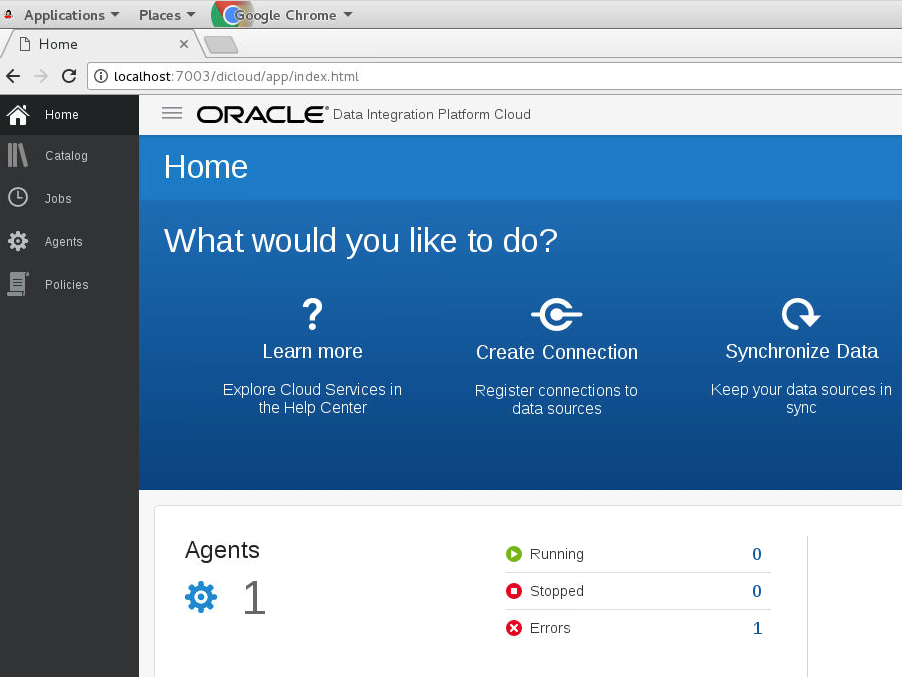
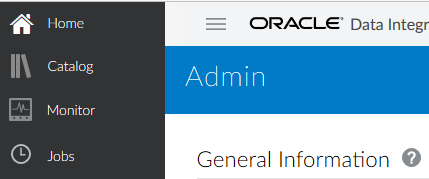
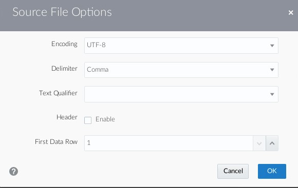

# Lab 500: Oracle ODI Data Preparation Lab

## Before You Begin

### Purpose
This lab shows you how to execute a Data Preparation elevated task; as well as how to define all necessary elements to run the task.

### Time to Complete 
Approximately 15 minutes.

### What Do You Need?
Your will need:
- DIPC Instance URL
- DIPC User and Password
- Flat file "webclicks.txt"

## Execute Data Preparation Elevated Task

### Login to DIPC
1. Open a browser window an provide your DIPC server URL. The URL will be provided by the instructor and will look like this one

https://osc132657dipc-oscnas001.uscom-central-1.oraclecloud.com/dicloud

2. Provide your user name and password, then click "Sign In" button

You will be navigated to your DIPC server Home page.

3. In the Home Page click on "Next" icon (>) located at the far right side of the top panel to locate the "Data Preparation" task icon

4. Once you have located the "Data Preparation" task icon, click on it

### Staging Connection Definition (Optional)
If you receive the following error message:

Click on "Select a default staging connection" hyperlink. You will navigate to the admin screen in which you can define this defualt connection.

1. Click on "Edit"

2. Open the "Oracle" field drop-down menu and select "SALES_TRG"
3. Click "Save" button.

4. You are now ready to run your "Data Preparation" task. Using the left panel, click on "Home".

5. In the Home Page click on "Next" icon (>) located at the far right side of the top panel to locate the "Data Preparation" task icon

4. Once you have located the "Data Preparation" task icon, click on it

### Execute Data Preparation Task

1.	Provide the following information:
	- Name: PrepWebData 
	- Description:  Prep External Website Data
2. For "Source Configuration" click on "Create Connection" button

3. Provide the following information:
	- Name: WebClicks_File
	- Description: Website Clicks information
	- Agent: Leave Blank
	- Type: File
	- Directory: /home/DIPC
 4. Click "Test Connection" button and when the test is successful click "Save" button

5. Provide the following information:
	
	**Source Configuration**
	- Connection: WebClicks_File
	- Directory: /home/DIPC
	- File: 
	
	**Target Configuration**
	- Connection: 
	- Schema: 
	- Data Entity: 

6.	Review Connections settings. 

7.	Click Test Connection – Review for Errors. 
- Click Save  

8.	Create Target Connection from the Catalog 
- NOTE: This connection may have already have been setup in a previous HOL 
- Click on the Create button and select Connection  

9.	Enter the following information  
- Name: Sync Target 
- Description: Sales OLTP Replicated Data 
- Agent: leave blank 
- Type: Oracle – selecting Oracle will expand the Connection Settings 
- Hostname: localhost 
- Port: 1521 
- Username: DIPC_TRG 
- Password: welcome1 
- Service Name: dics12c 
- Schema: DIPC_TRG 

10.	Click Test Connection, Review for errors 

11.	Click Save 

12.	Create Data Preparation Task Entries as follows 
- Name: Prep Web Data 
- Description: Prep External Website Data 
- Source Configuration 
-  Connection: LocalFileStore 
-  Directory: /home/DIPC 
-  File: Click Select - scroll to webclicks.txt 

- Select options for webclicks.txt as follows 

- No Text Qualifier 
- Ensure header is not enabled 
- First Data Row should be 1 
- Select OK

- Target Configuration 
-  Connection: DIPC_TRG 
-  Schema: DIPC_TRG 
-  Data Entity: webclicks  

13.	Click Save and Transform 

14.	The following screen will appear as the file is being parsed and profiled 

15. Once finished the data preparation screen will appear 

16. Begin prepping/transforming the file 

- The profiling process has captured advanced profiling information as the flat file was ingested.  Click each column to review the profiling results in the right hand data profile drawer. 
- There are also two views in which data can be prepped and transformed. To view the data view click the data tab 

17. To transform data click the menu bar on the column 

18. For Column 6 transform Shoes.html to shoes.html using the Replace transform 

19. Click Apply.  Clicking apply updates, the data, metadata and profiling statistics.  Also note the transform is saved and displayed in the left-hand drawer.  This transform can be deleted and the data, metadata and profiling statistics will be updated accordingly. 

- Column 1: Rename WROWID 
- Column 2: Rename CUSTID 
- Column 3: Rename LNAME 
- Column 4: Rename FNAME 
- Column 5: Rename PAGENAME 
- Column 6: Rename PAGEREFERRER 
- Column 7: Rename VISITDATE 

20. Review Transforms and Data

21. Click Save and Run 

22. Review Job Execution 
 

Summary 
 
You have now successfully completed the Hands on Lab, and have successfully performed an end-to-end data synchronization task through Oracle’s Data Integration Platform Cloud. 
