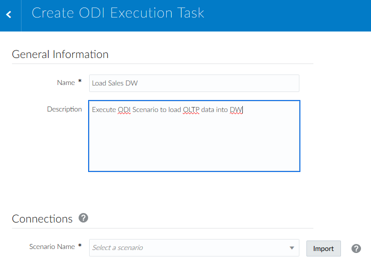
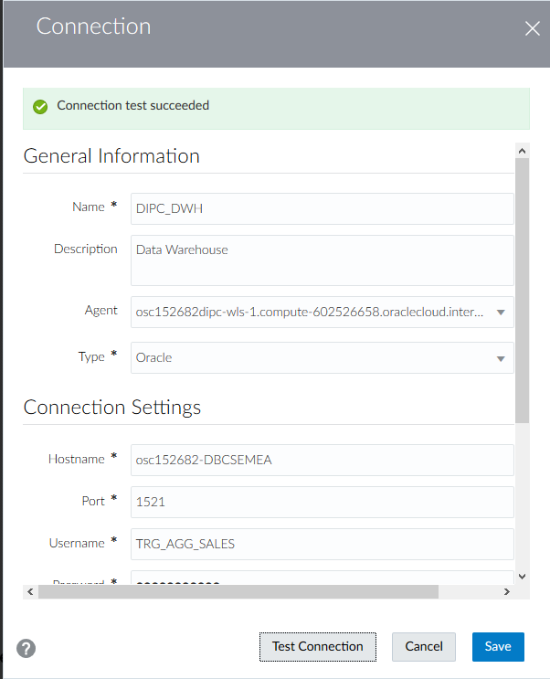
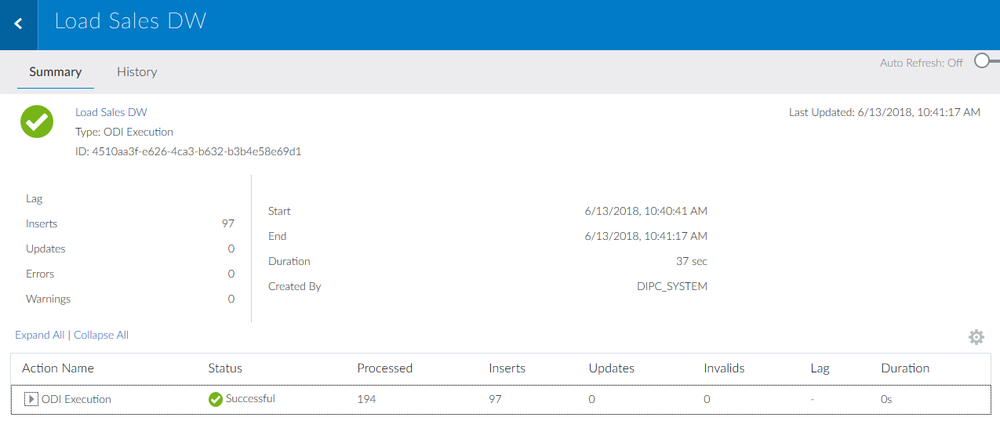
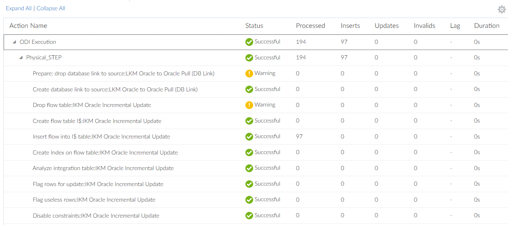

# Lab 600: Oracle Data Integration Lab Execution

# Overview 

Time to Complete 
- Perform all tasks – 20 Minutes 
- Prerequisites 
Before you begin this tutorial, you should 
•	Have a general understanding of RDBMS and data integration concepts. 
•	Have a general understanding of ETL and data synchronization concepts. 

Lab Environment 
For this lab, the Data Integration Platform Cloud and the client environment are contained within on environment for simplicity.  Most user interactions with Data Integration Platform Cloud will be through a browser installed on your local machine (Chrome preferred, Firefox is also supported).   

### **STEP 1**: [DIPC 18.2.3] Log into DIPC Console and go to Agent Page

-   Log into dashboard url provided with your single signon (update url for delivery)
-   https://myservices-gse00015126.console.oraclecloud.com/mycloud/cloudportal/dashboard

-   Enter single signon user id or id provided
	

	

-   Click "Data Integration Platform Cloud" (no login info was required)
-   Login may be required if accessing directly using console url
-   https://myservices-gse00015126.console.oraclecloud.com/mycloud/cloudportal/dashboard

	

-   Click "Open Service Console" in top right of page to view DIPC instance "DIPCINST'
	

-   Click menu on right and select "Data Integration Platform Console
		
	
2. Click Home 

## Logging Into Oracle Cloud Instance using VNC
- Use VNC to log into the VM. Use your favorite VNC client and enter \<hostname>:5901 as the URL to connect to  

- When prompted enter the password: welcome1 and click OK 

3. Use DIPC Demo Client 
- This hands-on lab uses a JDBC utility client that was built specifically for this demo.  This client is NOT part of DIPC, however it does help visualize the 
Synchronize Data and ODI Execution Job process 
- Open a Terminal 

- From the home directory execute ./startDIPCDemoClient.sh 

- Demo Client will open up and should be populated with the following data 

# Task 1: Create ODI Execution Task 

1. Click on Home in Navigation Bar

2. Click on ODI Execution (you may need to scroll right in the carousel to see it)

scroll right

scroll right

3. The ODI Execution Task screen appears 

4. Enter
•	Name: Load Sales DW 
•	Description: Execute ODI Scenario to load OLTP data into DW 

5.	Under Connections click on Import to import a deployment archive created in ODI Studio that contains the Scenario we want to execute 
- Navigate to DIPC/DIPC 18.2.3 and select LD_SALES_DIPC_18.2.3.zip 

- Click Open and wait for the import operation to complete (this will take about 2-3 minutes) 
- Click on the Scenario Name drop-down and select LD_TRG_SALES 001 

This scenario joins SRC_ORDERS and SRC_ORDER_LINES, aggregates the data, filters for ORDERS with Status of ‘CLO’ as well as performs an incremental update. 
So only replicated rows that have a status of ‘CLO’ closed, will be loaded to the target Sales DW. 

6.	In the Connection table pick the following Connections and Schemas: 
- ODI_DEMO_TRG:  
- Connection: Sync Target 
- Schema: ODI_TGT 

- ODI_DEMO_SRC 
- Connection: Sync Target 
- Schema: DIPC_TGT 

7.	Click on Save & Run to execute the Task  
8.	You will be redirected to the Jobs page and you will see a notification that a new Job execution started 
9.	When the Job appears in the list you can click on it to get more details 

10.	The Job Details contains all the details about the scenario execution in ODI 

You can click on any Step in the Job Execution to review the code generated by ODI 

When the Job has completed successfully you will see that the data has been fully loaded into the Target Sales Data Warehouse using OPI through the ODI execution task in the DIPC console

# Summary
In this lab, we have seen how DIPC and standalone ODI running in DIPC can work hand in hand to implement an end-to-end data flow.   